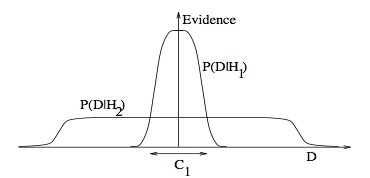
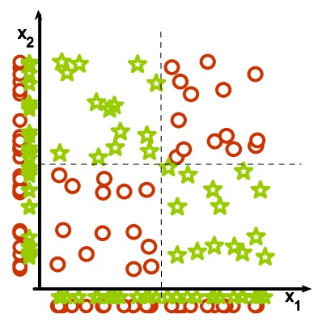
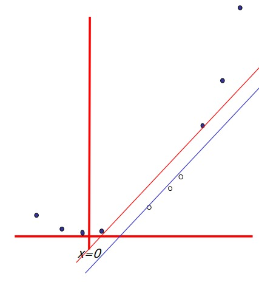
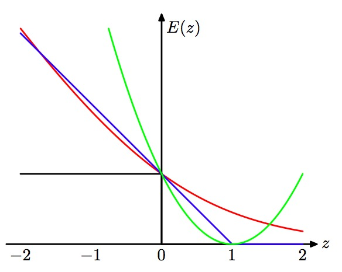
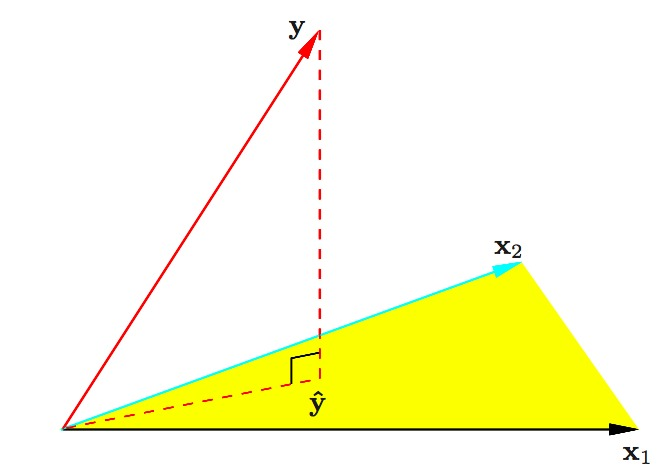
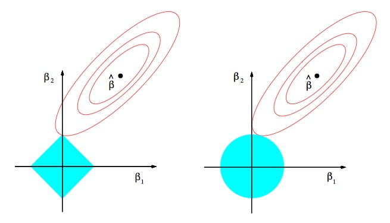

# 十张图解释机器学习的基本概念

在解释机器学习的基本概念的时候，我发现自己总是回到有限的几幅图中。以下是我认为最有启发性的条目列表。

Test and training error: 为什么低训练误差并不总是一件好的事情呢：ESL 图2.11.以模型复杂度为变量的测试及训练错误函数。

---

Under and overfitting: 低度拟合或者过度拟合的例子。PRML 图1.4.多项式曲线有各种各样的命令M，以红色曲线表示，由绿色曲线适应数据集后生成。

---

Occam’s razor

ITILA 图28.3.为什么贝叶斯推理可以具体化奥卡姆剃刀原理。这张图给了为什么复杂模型原来是小概率事件这个问题一个基本的直观的解释。水平轴代表了可能的数据集D空间。贝叶斯定理以他们预测的数据出现的程度成比例地反馈模型。这些预测被数据D上归一化概率分布量化。数据的概率给出了一种模型Hi,P(D|Hi)被称作支持Hi模型的证据。一个简单的模型H1仅可以做到一种有限预测，以P(D|H1)展示；一个更加强大的模型H2，举例来说，可以比模型H1拥有更加自由的参数，可以预测更多种类的数据集。这也表明，无论如何，H2在C1域中对数据集的预测做不到像H1那样强大。假设相等的先验概率被分配给这两种模型，之后数据集落在C1区域，不那么强大的模型H1将会是更加合适的模型。

---

Feature combinations：

(1)为什么集体相关的特征单独来看时无关紧要，这也是（2）线性方法可能会失败的原因。从Isabelle Guyon特征提取的幻灯片来看。

---

Irrelevant features:

为什么无关紧要的特征会损害KNN，聚类，以及其它以相似点聚集的方法。左右的图展示了两类数据很好地被分离在纵轴上。右图添加了一条不切题的横轴，它破坏了分组，并且使得许多点成为相反类的近邻。

---

Basis functions

非线性的基础函数是如何使一个低维度的非线性边界的分类问题，转变为一个高维度的线性边界问题。Andrew Moore的支持向量机SVM(Support Vector Machine)教程幻灯片中有：一个单维度的非线性带有输入x的分类问题转化为一个2维的线性可分的z=(x,x^2)问题。

---

Discriminative vs. Generative:

为什么判别式学习比产生式更加简单：PRML 图1.27.这两类方法的分类条件的密度举例，有一个单一的输入变量x（左图），连同相应的后验概率（右图）。注意到左侧的分类条件密度p(x|C1)的模式，在左图中以蓝色线条表示，对后验概率没有影响。右图中垂直的绿线展示了x中的决策边界，它给出了最小的误判率。

---

 Loss functions:

学习算法可以被视作优化不同的损失函数：PRML 图7.5. 应用于支持向量机中的“铰链”错误函数图形，以蓝色线条表示，为了逻辑回归，随着错误函数被因子1/ln(2)重新调整，它通过点（0，1），以红色线条表示。黑色线条表示误分，均方误差以绿色线条表示。

---

Geometry of least squares:

ESL 图3.2.带有两个预测的最小二乘回归的N维几何图形。结果向量y正交投影到被输入向量x1和x2所跨越的超平面。投影y^代表了最小二乘预测的向量。

---

Sparsity:

为什么Lasso算法（L1正规化或者拉普拉斯先验）给出了稀疏的解决方案（比如：带更多0的加权向量）：ESL 图3.11.lasso算法的估算图像(左)以及岭回归算法的估算图像（右）。展示了错误的等值线以及约束函数。分别的，当红色椭圆是最小二乘误差函数的等高线时，实心的蓝色区域是约束区域|β1| + |β2| ≤ t以及β1^2^ + β2^2^ ≤ t2。
