# 机器学习实战

<!-- MarkdownTOC -->

- 第一部分 分类
- 第 1 章 机器学习基础
    - 如何选择合适的算法
    - 开发机器学习应用程序的步骤
- 第 2 章 k-近邻算法(kNN)
    - k-近邻算法的一般流程
    - 使用k-近邻算法改进约会网站的配对效果
        - 使用 Matplotlib 创建散点图
        - 归一化数值
        - 测试算法
    - 小结
- 第 3 章 决策树
    - 决策树的一般流程
    - 小结
- 第 4 章 基于概率论的分类方法：朴素贝叶斯
    - 朴素贝叶斯的一般过程
    - 文档词袋模型
    - 过滤垃圾电子邮件
    - 小结
- 第 5 章 Logistic 回归
    - Logitstic 回归的一般过程
    - 基于最优化方法的最佳回归系数确定
        - 梯度上升法
        - 处理数据中的缺失值
    - 小结
- 第 6 章 支持向量机
    - 基于最大间隔分隔数据
    - SVM 的一般流程
    - SMO 高效优化算法
    - 在复杂数据上应用核函数
        - 利用核函数将数据映射到高维空间
        - 径向基核函数
    - 小结
- 第 7 章 利用 AdaBoost 元算法提高分类性能
    - 基于数据集多重抽样的分类器
        - bagging：基于数据随机重抽样的分类器构建方法
        - boosting
    - AdaBoost 的一般流程
    - 训练算法：基于错误提升分类器的性能
    - 构建弱分类器
    - 完整的 AdaBoost 算法实现
    - 一个实例
- 非均衡分类问题

<!-- /MarkdownTOC -->

## 第一部分 分类

本书前两部分主要谈好监督学习(supervised learning)。在监督学习过程中，我们只需要给定输入样本集，机器就可以 从中推演出指定目标变量的可能结果。监督学习相对比较简单，机器只需从输入数据中预测合适的模型，并从中计算出目标变量的结果。

监督学习一般使用两种类型的目标变量：标称型和数值型。标称型目标变量的结果只在有限目标集中取值，如真与假。数值型目标变量主要用于回归分析。

## 第 1 章 机器学习基础

机器学习：利用计算机来彰显数据背后的真实含义。

简单地说，机器学习就是把无序的数据转换成有用的信息。

机器学习的主要任务就是**分类**。最终我们决定使用某个机器学习算法进行分类，首先需要做的是算法训练，即学习如何分类。通常我们为算法输入大量已分类数据作为算法的**训练集**。训练集是用于训练机器学习算法的数据样本集合，其中包含若干**训练样本**，每个训练样本会有若干种特征以及一个**目标变量**。目标变量是机器学习算法的预测结果，在分类算法中目标变量的类型通常是标称型的，而在回归算法中通常是连续型的。训练样本集必须确定知道目标变量的值，以便机器学习算法可以发现特征和目标变量之间的关系。

我们通常将分类问题中的目标变量称为**类别**，并假定分类问题只存在有限个数的类别。

> 特征或者属性通常是训练样本集的列，它们是独立测量得到的结果，多个特征联系在一起共同组成一个训练样本

为了测试机器学习算法的效果，通常使用两套独立的样本集：训练数据和**测试数据**。当机器学习程序开始运行时，使用训练样本集作为算法的输入，训练完成之后输入测试样本。比较测试样本预测的目标变量值域实际样本类别之间的差别，就可以得出算法的实际精确度。

机器学习的另一项任务是**回归**，它主要用于预测数值型数据。例子：数据拟合曲线，通过给定数据点的最优拟合曲线。分类和回归属于**监督学习**，之所以称之为监督学习，是因为这类算法必须知道预测什么，即目标变量的分类信息。

与监督学习相对于的是**无监督学习**，此时数据没有类别信息，也不会给定目标值。在无监督学习中，将数据集合分成由类似的对象组成的多个类的过程被称为**聚类**；将寻找描述数据统计值的过程称之为**密度估计**。此外，无监督学习还可以减少数据特征的维度，以便我们可以使用二维或三维图形更加直观地展示数据信息。

监督学习 | 用途
--- | ---
k-近邻算法 | 线性回归
朴素贝叶斯算法 | 局部加权线性回归
支持向量机 | Ridge 回归
决策树 | Lasso 最小回归系数估计

无监督学习 | 用途
--- | ---
k-均值 | 最大期望算法
DBSCAN | Parzen 窗设计

### 如何选择合适的算法

首先考虑使用机器学习算法的目的。如果想要预测目标变量的值，则可以选择监督学习算法，否则可以选择无监督学习算法。确定选择监督学习算法之后，需要进一步确定目标变量的类型，如果目标变量是离散型，则可以选择分类器算法；如果目标变量是连续型的数值，则需要选择回归算法。

如果不想预测目标变量的值，则可以选择无监督学习算法。进一步分析是否需要将数据划分为离散的组。如果这是唯一的需求，则使用聚类算法；如果还需要估计数据与每个分组的相似程度，则需要使用密度估计算法。

其次需要考虑的是数据问题。对实际数据了解得越充分，越容易创建符合实际需求的应用程序。主要应该了解数据的以下特性：特征值是离散型变量还是连续型变量，特征值中是否存在缺失的值，何种原因造成缺失值，数据中是否存在异常值，某个特征发生的概率如何。

一般来说，发现最好算法的关键环节是反复试错的迭代过程。

### 开发机器学习应用程序的步骤

1. **收集数据**。爬虫、RSS、API、设备数据。公开可用的数据源
2. **准备输入数据**。确保数据格式符合要求
3. **分析输入数据**。图形化展示
4. **训练算法**。抽取知识或信息
5. **测试算法**。评估效果
6. **使用算法**。将算法转换为应用程序

## 第 2 章 k-近邻算法(kNN)

简单来说，k-近邻算法采用测量不同特征值之间的距离方法进行分类。

+ 优点：精度高、对异常值不敏感、无数据输入假定
+ 缺点：计算复杂度高、空间复杂度高
+ 适用数据范围：数值型和标称型

工作原理：存在一个样本数据集合，也称作训练样本集，并且样本集中每个数据都存在标签，即我们知道样本集中每一数据与所属分类的对应关系。输入没有标签的新数据后，将新数据的每个特征与样本集中对应的特征进行比较，然后算法提取样本集中前 k 个最相似的数据。最后，选择 k 个最相似数据中出现次数最多的分类，作为新数据的分类。

### k-近邻算法的一般流程

1. 收集数据：可以使用任何方法
2. 准备数据：距离计算所需要的数值，最好是结构化的数据格式
3. 分析数据：可以使用任何方法
4. 训练算法：此步骤不适用于k-近邻算法
5. 测试算法：计算错误率
6. 使用算法：首先需要输入样本数据和结构化的输出结果，然后运行k-近邻算法判定输入数据分别属于哪个分类，最后应用对计算出的分类执行后续的处理

对未知类别属性的数据集中的每个点依次执行以下操作：

1. 计算已知类别数据集中的点与当前点之间的距离；
2. 按照距离递增次序排序；
3. 选取与当前点距离最小的 k 个点；
4. 确定前 k 个点所在类别的出现频率
5. 返回前 k 个点出现频率最高的类别作为当前点的预测分类

具体可以参考 `AlgorithmTour/MachineLearningInAction/kNN.py`

    import kNN
    group, labels = kNN.createDataSet()
    kNN.classify0([0,0], group, labels, 3)

### 使用k-近邻算法改进约会网站的配对效果

海伦收集了一些约会数据，包括：

+ 每年获得的飞行常客里程数
+ 玩视频游戏所耗时间百分比
+ 每周消费的冰激凌公升数

使用 `file2matrix` 函数把数据 `datingTestSet.txt` 读入到程序中

    reload(kNN)
    datingDataMat, datingLabels = kNN.file2matrix('datingTestSet2.txt')

#### 使用 Matplotlib 创建散点图

在 Python 命令行环境中

    import matplotlib
    import matplotlib.pyplot as plt
    from numpy import array
    fig = plt.figure()
    ax = fig.add_subplot(111)
    ax.scatter(datingDataMat[:,1], datingDataMat[:,2])
    plt.show()

得到下图

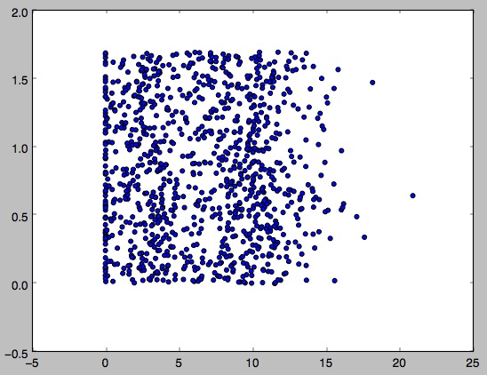

乱七八糟完全看不清，使用 `scatter` 函数利用标签来个性化标记

    ax.scatter(datingDataMat[:,1], datingDataMat[:,2], 15.0*array(datingLabels), 15.0*array(datingLabels))
    plt.show()

标上颜色之后，效果会好很多，可是依然很难从中获得什么有效的信息

(以上两张图的横轴是玩视频游戏所耗时间百分比，总州市每周消费的冰淇淋公升数)

如果把横轴和纵轴换成每年获取的飞行常客里程数和玩视频游戏所耗时间百分比，结论会更清晰一些

    ax.scatter(datingDataMat[:,0], datingDataMat[:,1], 15.0*array(datingLabels), 15.0*array(datingLabels))
    plt.show()

#### 归一化数值

为了避免不同的特征的数值不同所导致的影响不同，可能需要进行归一化，也就是把特征值转换成[0,1]值

#### 测试算法

机器学习算法一个很重要的工作就是评估算法的正确率，通常我们只提供已有数据的 90% 作为训练样本来训练分类器，而使用剩余的 10% 数据去测试分类器，检测分类器的正确率

之后是手写的另一个例子，就略过了，总体思想是差不多的。

### 小结

k-近邻算法是分类数据最简单最有效的算法，必须保存全部数据集，如果训练数据集很大，必须使用大量的存储空间。此外，由于必须对数据集中的每个数据计算距离值，实际使用可能非常耗时。**k决策树**是其优化版本，可以节省大量的计算开销。

另一个却显示它无法给出任何数据的基础结构信息，因此我们也无法知晓平均实例样本和典型实例样本具有什么特征。使用**概率测量方法**可以解决这个问题。

## 第 3 章 决策树

决策树的主要优势在于数据形式非常容易理解。决策树很多任务都是为了数据中所蕴含的知识信息，因此决策树可以使用不熟悉的数据集合，并从中提取出一系列规则，机器学习算法最终将使用这些机器从数据集中创造的规则。

+ 优点：计算复杂度不高，输出结果易于理解，对中间值的缺失不敏感，可以处理不相关特征数据。
+ 缺点：可能会产生过度匹配问题。
+ 适用数据类型：数值型和标称型。

在构造决策树时，我们需要解决的第一个问题就是，当前数据集上哪个特征在划分数据分类时起决定性作用。为了找到决定性的特征，划分出最好的结果，我们必须评估每个特征。完成测试之后，原始数据集就被划分为几个数据子集。这些数据子集会分布在第一个决策点的所有分支上。

### 决策树的一般流程

1. 收集数据：可以使用任何方法
2. 准备数据：树构造算法只适用于标称型数据，因此数值型数据必须离散化
3. 分析数据：可以使用任何方法，构造树完成之后，我们应该检查图形是否符合预期
4. 训练算法：构造树的数据结构
5. 测试算法：使用经验树计算错误率
6. 使用算法：此步骤可以适用于任何监督算法，而使用决策树可以更好地理解数据的内在含义

这里使用 [ID3](http://en.wikipedia.org/wiki/ID3) 算法划分数据集

划分数据集的大原则是：将无序的数据变得更加有序。组织杂乱无章数据的一种方法就是使用信息论度量信息。**信息增益(information gain)**和**熵(entropy)**

代码在 `tree.py` 中

熵越高，则混合的数据也越多。另一个度量集合无序程度的方法是基尼不纯度(Gini impurity)，简单地说就是从一个数据集中随机选取子项，度量其被错误分类到其他分组里的概率。

抽取不同的特征，根据剩下特征熵的大小，来决定哪个特征是最重要的，然后递归生成决策树。

然后就是用 Matplotlib 把树画出来

### 小结

决策树分类器就像带有终止块的流程图，终止块表示分类结果。开始处理数据时，我们首先需要测量集合中数据的不一致性，也就是熵，然后寻找最优方案划分数据集，直到数据集中的所有数据属于同一分类。

ID3 算法可以用于划分标称型数据集。构造决策树时，我们通常采用递归的方法将数据集转化为决策树。

决策树可能会产生过多的数据集划分，从而产生过度匹配数据集的问题。我们可以通过裁剪决策树，合并相邻的无法产生大量信息增益的叶节点，消除过度匹配的问题。

## 第 4 章 基于概率论的分类方法：朴素贝叶斯

概率论是许多机器学习算法的基础，所以深刻理解这一主题就显得十分重要。

+ 优点：在数据较少的情况下仍然有效，可以处理多类问题
+ 缺点：对于输入数据的准备方式较为敏感
+ 适用数据类型：标称型数据

机器学习的一个重要应用就是文档的自动分类。在文档分类中，整个文档是实例，而电子邮件中的某些元素则构成特征。我们可以观察文档中出现的词，并把每个词出现或者不出现作为一个特征，这样得到的特征数目就会跟词汇表中的词目一样多。朴素贝叶斯是用于文档分类的常用算法。

### 朴素贝叶斯的一般过程

1. 收集数据：可以使用任何方法。这里使用 RSS 源
2. 准备数据：需要数值型或者布尔型数据
3. 分析数据：有大量特征时，绘制特征作用不大，此时使用直方图效果更好
4. 训练算法：计算不同的独立特征的条件概率
5. 测试算法：计算错误率
6. 使用算法：一个常见的朴素贝叶斯应用是文档分类。可以在任意的分类场景中使用朴素贝叶斯分类器，不一定非要是文本

朴素贝叶斯的两个假设：

+ 一个特征或者单词出现的可能性与它和其他单词相邻没有关系。
+ 每个特征同等重要

看起来有点不合理，但是这也就是为什么要称其为“朴素”的原因。

朴素贝叶斯分类器通常有两种实现方式：一种基于伯努利模型实现，一种基于多项式模型实现。这里采用第一种实现方式。该实现方式中兵不考虑词在文档中出现的次数，只考虑出不出现，因此在这个意义上相当于假设词是等权重的

利用贝叶斯分类器对文档进行分类时，要计算多个概率的乘积以获得文档属于某个类别的概率。如果其中一个概率值为0，那么最后乘积也为0。为了降低这种影响，可以将所有词出现数字初始化为1，并将分母初始化为2

另一个遇到的问题是下溢出，这是由于太多很小的数相乘造成的，这里取对数，就可以把乘法变为加法，并且对最后结果没有影响。

### 文档词袋模型

目前为止，我们将每个词的出现与否作为一个特征，这可以被描述为**词集模型(set-of-words model)**。如果一个词在文档中出现不止一次，这可能意味着包含该词是否出现在文档中所不能表达的某种信息，这个方法被称为**词袋模型(bag-of-words model)**。在词袋中，每个单词可以出现多次，而在词集中，每个词只能出现一次。

### 过滤垃圾电子邮件

准备数据：切分文本。去掉标点符号，统一大小写

随机选择数据的一部分作为训练集，而剩余部分作为测试集的过程称为**留存交叉验证(hold-out cross validation)**。为了更精确地估计分类器的错误率，就应该进行多次迭代后求出平均错误率。

移除停止词会降低分类错误率

### 小结

对于分类来说，使用概率有时要比使用硬规则更为有效。贝叶斯概率及贝叶斯准则提供了一种利用已知值来估计位置概率的有效方法。

词袋模型在解决文档分类问题上比词集模型有所提高。

## 第 5 章 Logistic 回归

假设现在有一些数据点，我们用一条直线对这些点进行拟合(该线称为最佳拟合直线)，这个拟合过程就称作回归。利用 Logistic 回归进行分类的主要思想是：根据现有数据对分类边界线建立回归公式，以此进行分类。

### Logitstic 回归的一般过程

1. 收集数据：采用任意方法收集数据
2. 准备数据：由于需要进行距离计算，因此要求数据类型为数值型。另外，结构化数据格式最佳
3. 分析数据：采用任一方法对数据进行分析
4. 训练算法：大部分时间将用于巡礼那，训练的目的是为了找到最佳的分类回归系数
5. 测试算法：一旦训练步骤完成，分类将会很快
6. 使用算法：首先，我们需要输入一些数据，并将其转换成对应的结构化数值；接着，基于训练好的回归系数就可以对这些数值进行简单的回归计算，判定它们属于哪个类别；在这之后，我们就可以在输出的类别上做一些其他分析工作

+ 优点：计算代价不高，易于理解和实现
+ 缺点：容易欠拟合，分类精度可能不高
+ 适用数据类型：数值型和标称型

我们想要的函数应该是，能接受所有的输入然后预测出类别。例如，在两个类的情况下，上述函数输出 0 或 1。或许之前有接触过**海维塞德阶跃函数(Heaviside step function)**，或者直接称为**单位阶跃函数**。可是这个函数比较难处理。不过我们可以采用一个类似的但是好处理的函数——**Sigmoid 函数**

为了实现 Logistic 回归的分类器，我们可以子啊每个特征上都乘以一个回归系数，然后把所有的结果值相加，将这个总和代入 Sigmoid 函数中，进而得到一个范围在[0, 1]之间的值。任何大于0.5的被分为1类，小于0.5的被归入0类，也可以看成是一种概率估计。

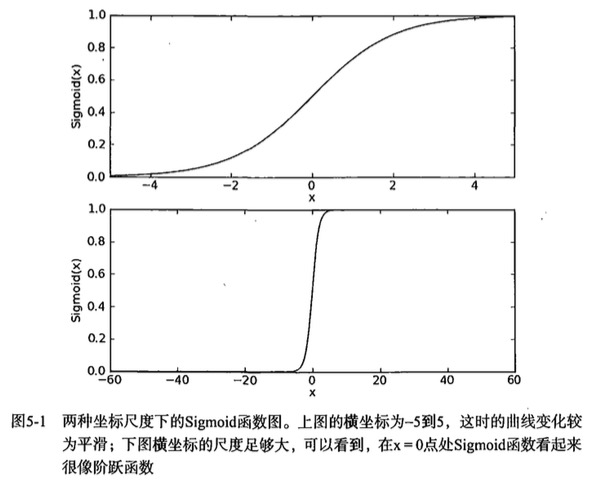

所以我们现在的问题就是，最佳回归系数是多少？

### 基于最优化方法的最佳回归系数确定

Sigmoid 函数的输入记为 z，由下面公式得出：z = w~0~x~0~ + w~1~x~1~ + w~2~x~2~ + ... + w~n~x~n~

如果采用向量的写法，就可以写成 z = w^T^x，其中向量 x 是分类器的输入数据，向量 w 也就是我们要找到的最佳参数(系数)，从而使得分类器尽可能地准确。

#### 梯度上升法

要找到某函数的最大值，最好的方法是沿着该函数的梯度方向探寻。如果梯度记为 ▽，则函数 f(x,y)的梯度由下式表示

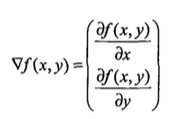

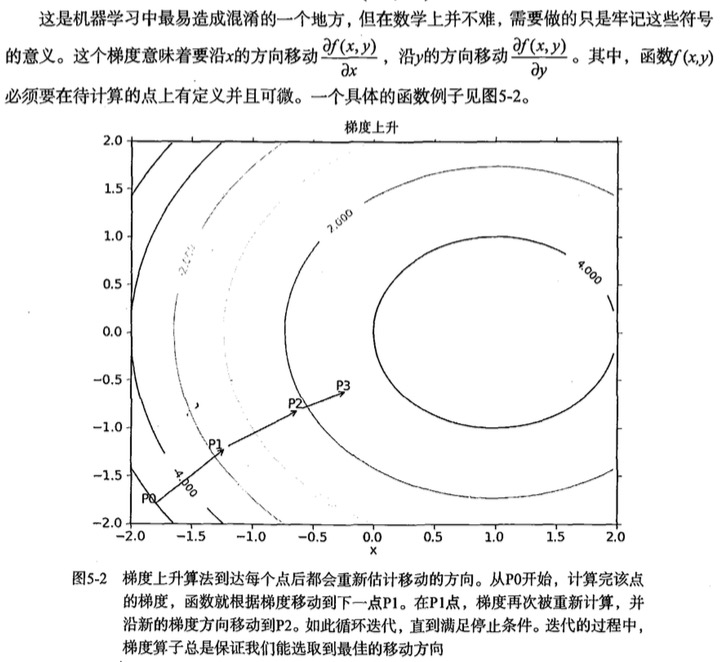

可以看到，梯度算子总是指向函数增长最快的方向。这里所说的是移动方向，而未提到移动量的大小。该量值成为步长，记为 α。用向量来表示的话，梯度算法的迭代公式为：w := w + α▽~w~f(w)

该公式将一直被迭代执行，直到达到某个停止条件为止，比如迭代次数达到某个指定值或算法达到某个可以允许的误差范围。

为了减少运算量，可以使用**随机梯度上升**算法。步长应该随着迭代次数增加而不断减少，如果不是严格下降的，就接近于模拟退火算法。

一个判断优化算法优劣的可靠方式是看它是否收敛，也就是说参数是否达到了稳定值，是否还会不断地变化。

#### 处理数据中的缺失值

+ 使用可用特征的均值来填补缺失值
+ 使用特殊值来填补缺失值，如 -1
+ 忽略有缺失值的样本
+ 使用相似样本的均值填补缺失值
+ 使用另外的机器学习算法预测缺失值

### 小结

Logistic 回归的目的是寻找一个非线性函数 Sigmoid 的最佳拟合参数，求解过程可以由最优化算法来完成。在最优化算法中，最常用的就是梯度上升算法，而梯度上升算法又可以简化为随机梯度上升算法。

随机梯度上升算法与梯度上升算法的效果相当，但占用更少的计算资源。此外，随机梯度上升是一个在线算法，它可以在新数据到来时就完成参数更新，而不需要重新读取整个数据集来进行批处理运算。

## 第 6 章 支持向量机

SVM 有很多实现，但是这里只关注最流行的一种，即**序列最小化(Sequential Minmal Optimization, SMO)**算法。在此之后，将介绍如何使用一种称为**核函数(kernel)**的方式将 SVM 扩展到更多数据集上。

### 基于最大间隔分隔数据

+ 优点：泛化错误率低，计算开销不大，结果易解释
+ 缺点：对参数调节和核函数的选择敏感，原始分类器不加修改仅适用于处理二元分类问题
+ 适用数据类型：数值型和标称型

将数据集分隔开来的直线称为**分隔超平面(separating hyperplane)**。如果数据对象是1024维的，那么就需要一个1023维的某某对象来对数据进行分隔，这个对象就叫**超平面(hyperplane)**，也就是分类的决策边界。分布在超平面一侧的所有数据都属于某个类别，而分布在另一侧的所有数据则属于另一个类别。

我们希望能找到离分隔超平面最近的点，确保它们离分隔面的距离尽可能远。这里点到分隔面的距离被称为**间隔(margin)**。我们希望间隔尽可能大，因为如果我们犯错或者在有限数据上训练分类器的话，我们希望分类器尽可能健壮。

**支持向量(support vector)**就是离分隔超平面最近的那些点。接下来要试着最大化支持向量到分隔面的距离。

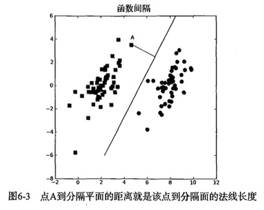

分隔超平面的形式可以写成 w^T^x+b。要计算点 A 到分隔超平面的距离，就必须给出点到分隔面的法线或垂线的长度，值为 |w^T^A+b|/||w||。这里的常数 b 类似于 Logistic 回归中的截距 w~0~。

分类器接收了输入数据后，会输出一个类别标签，这相当于一个类似于 Sigmoid 的函数。下面将使用**海维塞德阶跃函数**对 w^T^x+b 作用得到 f(w^T^x+b)，其中 u<0 时 f(u) 输出 -1，反之输出 +1。

当计算数据点到分隔面的距离并确定分隔面的放置位置时，间隔是通过 label x (w^T^+b)来计算的。如果数据点处于正方向(+1)，w^T^x+b 会是一个很大的正数，同时 label x (w^T^+b)也会是一个很大的正数；而处于负方向时(-1)，label x (w^T^+b) 仍然会是一个很大的正数

现在的目标就是找出分类器定义中的 w 和 b。为此，我们必须找到具有最小间隔的数据点，而这些数据点也就是前面提到的支持向量。一旦找到具有最小间隔的数据点，我们就需要对该间隔最大化：

直接求解上述问题相当困难，所以需要将它转换成为另一种更容易求解的形式。

先考察一下大括号中的部分。由于对乘积进行优化是一件很讨厌的事情，因此我们要做的是固定其中一个因子而最大化其他因子。如果令所有支持向量的 label x (w^T^+b) 都为 1，那么就可以通过求 ||w|| 的最大值来得到最终解。但是，并非所有数据点的 label x (w^T^+b) 都等于 1，只有那些离分割超平面最近的点得到的值才为 1。而离超平面越远的数据点，其 label x (w^T^+b) 的值也就越大。

这里的约束条件就是 label x (w^T^+b) >= 1。对于这类优化问题，有一个非常著名的求解方法，拉格朗日乘子法。通过引入拉格朗日乘子，我们就可以基于约束条件来表述原来的问题。由于这里的约束条件都是基于数据点的，因此我们就可以将超平面写成数据点的形式，优化函数就变成(这里不懂...)：

> label x (w^T^+b) 被称为点到分隔面的函数间隔，label x (w^T^+b) / ||w|| 称为点到分隔面的几何间隔

> 尖括号表示两个向量的内积

约束条件为

考虑到数据不可能非常完美，就需要引入**松弛变量(slack variable)**来允许有些数据点可以处于分隔面错误的一侧。这样我们的优化目标就能保持仍然不变，但约束条件变成：

这里的常数 C 用于控制“最大化间隔”和“保证大部分点的函数间隔小于1.0”这两个目标的权重。在优化算法的实现代码中，常数 C 是一个参数，因此我们就可以通过调节该参数得到不同的结果。一旦求出了所有的 α，那么分隔超平面就可以通过这些 α 来表达。这一结论十分直接，SVM 中的主要工作就是求解这些 α。

要理解刚才这些公式还需要大量知识，请查阅相关资料。

### SVM 的一般流程

1. 收集数据：可以使用任何方法
2. 准备数据：需要数值型数据
3. 分析数据：有助于可视化分隔超平面
4. 训练算法：SVM 的大部分时间都源自训练，该过程主要实现两个参数的调优
5. 测试算法：十分简单的计算过程就可以实现
6. 使用算法：几乎所有分类问题都可以使用 SVM，值得一提的是，SVM 本身是一个二元分类器，对多类问题应用 SVM 需要对代码做一些修改

### SMO 高效优化算法

**Platt 的 SMO 算法**

SMO 表示**序列最小化(Sequential Minimal Optimization)**。Platt 的 SMO 算法是将大优化问题分解为多个小优化问题来求解的。这些小优化问题往往很容易求解，并且对它们进行顺序求解的结果与将它们作为整体来求解的结果是完全一致的。

SMO 算法的目标是求出一系列 α 和 b，一旦求出了这些 α，就很容易计算出权重向量 w 并得到分隔超平面。

SMO 算法的工作原理是：每次循环中选择两个 α 进行优化处理。一旦找到一对合适的 α，那么就增大其中一个同时减小另一个。这里所谓的“合适”就是指两个 α 必须要符合一定的条件，条件之一就是这两个 α 必须要在间隔边界之外，第二个条件则是这两个 α 还没有进行过区间化处理或者不在边界上。

Platt SMO 算法中的外循环确定要优化的最佳 α 对。而简化版会跳过这一部分，首先在数据集上遍历每一个 α，然后在剩下的 α 集合中随机选择另一个 α，从而构建 α 对。这一点相当重要，要同时改变，因为我们有一个约束条件：

由于改变一个 α 可能会导致该约束条件失效，因此我们总是同时改变两个 α。

伪代码：

    创建一个 α 向量并将其初始化为 0 向量
    当迭代次数小于最大迭代次数时(外循环)
        对数据集中的每个数据向量(内循环):
            如果该数据向量可以被优化:
                随机选择另外一个数据向量
                同时优化这两个向量
                如果两个向量都不能被优化，退出内循环
        如果所有向量都没有被优化，增加迭代数量，继续下一次循环

**完整的Platt SMO算法**

在在选择第一个 α 值后，算法会通过一个内循环来选择第二个 α 值。在优化过程中，会通过**最大化步长**的方式来获得第二个 α 值。

### 在复杂数据上应用核函数

核函数(kernel) 和 径向基函数(fadial basis function)

#### 利用核函数将数据映射到高维空间

从某个特征空间到另一个特征空间的映射是通过核函数来实现的。可以把核函数想象成一个**包装器(wrapper)**或者是**接口(interface)**，它能把数据从某个很难处理的形式转换成另一种较易处理的形式。

SVM 优化中一个特别好的地方是，所有的运算都可以写成**内积(inner product)**的形式。向量的内积指的是两个向量相乘，之后得到单个标量或者数值。我们可以把内积运算替换成核函数，而不必做简化处理。将内积替换成核函数的方式被称为**核技巧(kernel trick)**或者**核变电(kernel substation)**。

#### 径向基核函数

采用向量作为自变量的函数，基于向量距离运算输出一个标量。这个距离可以是从<0, 0>向量或者其他向量开始计算的距离，我们使用径向基函数的高斯版本，公式如下：

上述高斯核函数将数据从其特征空间映射到更高维的空间，具体来说这里是映射到一个无穷维的空间。

支持向量的数目存在一个最优值。SVM 的优点在于它能对数据进行高效分类。如果支持向量太少，就可能会得到一个很差的决策边界；如果支持向量太多，也就相当于每次都利用整个数据集进行分类，这种分类方法称为 k近邻。

可以这么看 SVM 比 k 近邻好的地方在于，从很多数据中找到最有代表性的数据点来作为分类的依据，可以有效减少多余的计算。

### 小结

支持向量机的泛化错误率较低，也就是说它具有良好的学习能力，且学到的结果具有很好的推广性。这些优点使得向量机十分流行，有些人认为它是监督学习中最好的定式算法。

支持向量机试图通过求解一个二次优化问题来最大化分类间隔。

和方法或者说核技巧会将数据(有时是非线性数据)从一个低维空间映射到一个高维空间，可以将一个在低维空间中的非线性问题转换成高维空间下的线性问题来求解。和方法不止在 SVM 中适用，还可以用于其他算法中。而其中径向基函数是一个常用的度量两个向量距离的核函数。

支持向量机是一个二元分类器。当用其解决多元问题时，则需要额外的方法对其进行扩展。SVM 的效果也对优化参数和所用核函数中的参数敏感。

## 第 7 章 利用 AdaBoost 元算法提高分类性能

**元算法(meta-algorithm)**是对其他算法进行组合的一种方式。某些人认为 AdaBoost 是最好的监督学习的方法，是机器学习工具箱中最强有力的工具之一。

### 基于数据集多重抽样的分类器

前面已经介绍了五种不同的分类算法，它们各有优缺点。我们自然可以将不同的分类器组合起来，而这种组合结果则被称为**集成方法(ensemble method)**或者**元算法(meta-algorithm)**。使用集成方法时会有多种形式：可以是不同算法的集成，也可以是同一算法在不同设置下的集成，还可以是数据集不同部分分配给不同分类器之后的集成。

+ 优点：泛化错误率低，易编码，可以应用在大部分分类器上，无参数调整
+ 缺点：对离群点敏感
+ 适用数据类型：数值型和标称型

#### bagging：基于数据随机重抽样的分类器构建方法

**自举汇聚法(bootstrap aggregating)**，也称为 bagging 方法，是在从原始数据集选择 S 次后得到 S 个新数据集的一种技术。新数据集和原数据集的大小相等。每个数据集都是通过在原始数据集中随机选择一个样本来进行替换而得到的。这一性质就允许新数据集中可以有重复的值，而原始数据集的某些值在新集合中则不再出现。

在 S 个数据集建好之后，将某个学习算法分贝作用域每个数据集就得到了 S 个分类器。当我们要对新数据进行分类时，就可以应用这 S 个分类器进行分类，与此同时，选择分类器投票结果中最多的类别作为最后的分类结果。

也有一些更先进的 bagging 方法，比如**随机森林(random forest)**，一些[参考资料](http://www.stat.berkeley.edu/~breiman/RandomForests/cc_home.htm)

#### boosting

boosting 是一种与 bagging 很类似的技术。不论是在 boosting 还是 bagging 当中，所使用的多个分类器的类型都是一致的。但是在前者当中，不同的分类器是通过串行训练而获得的，每个新分类器都根据已训练出的分类器的性能来进行训练。boosting 是通过集中关注被已有分类器错分的那些数据来获得新的分类器。

由于 boosting 分类的结果是基于所有分类器的加权求和结果的，因此 boosting 与 bagging 不太一样。bagging 中的分类器权重是相等的，而 boosting 中的分类器权重并不相等，每个权重代表的是其对应分类器在上一轮迭代中的成功度。

boosting 方法拥有多个版本，这里只关注最流行的 AdaBoost

### AdaBoost 的一般流程

1. 收集数据：可以使用任何方法
2. 准备数据：依赖于所使用的弱分类器类型。作为弱分类器，简单分类器的效果更好
3. 分析数据：可以使用任何方法
4. 训练算法：AdaBoost 的大部分时间都用在训练上，分类器将多次在同一数据集上训练弱分类器
5. 测试算法：计算分类的错误率
6. 使用算法：同 SVM 一样，AdaBoost 预测两个类别中的一个。如果想把它应用到多个类别，就需要进行修改

### 训练算法：基于错误提升分类器的性能

能否使用弱分类器和多个实例来构建一个强分类器？这是一个非常有趣的理论问题。这里的“弱”意味着分类器的性能比所及猜测要略好，但是也不会好太多。AdaBoost 算法即脱胎于上述理论问题。

AdaBoost 是 adaptive boosting(自适应 boosting)的缩写，其运行过程如下：训练数据中的每个样本各有一个权重，这些权重构成了向量 D。一开始，这些权重都初始化成相等值。首先在训练数据上训练处一个弱分类器并计算该分类器的错误率，然后在同一数据集上再次训练弱分类器。在分类器的第二次训练当中，将会重新调整每个样本的权重，其中第一次分对的样本的权重将会降低，而第一次分错的样本的权重将会提高。

为了从所有弱分类器中得到最终的分类结果，AdaBoost 为每个分类器都分配了一个权重值 α，这些 α 值是基于每个弱分类器的错误率进行计算的。错误率和 α 的公式为

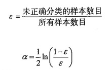

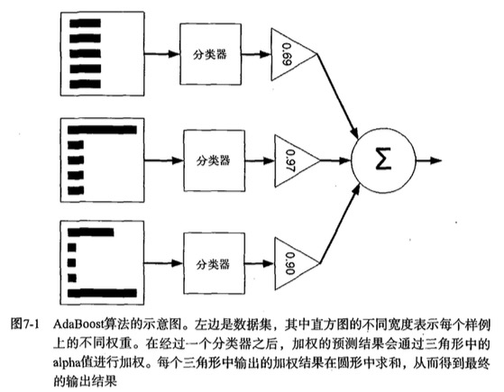

计算出 α 值之后，可以对权重向量 D 进行更新，以使那些正确分类的样本的权重降低而错分样本的群众升高。D 的计算方法如下：

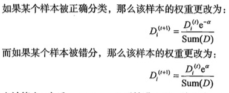

计算出 D 之后，AdaBoost 又开始进入下一轮迭代。AdaBoost 算法会不断地重复训练和调整权重的过程，直到训练错误率为 0 或者弱分类器的数目达到用户的指定值为止。

### 构建弱分类器

**单层决策树(decision stump, 决策树桩)**是一种简单的决策树，仅基于单个特征来做决策。

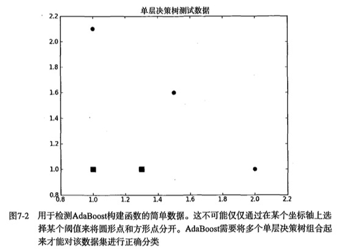

伪代码：

### 完整的 AdaBoost 算法实现

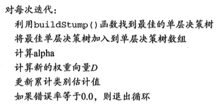

### 一个实例

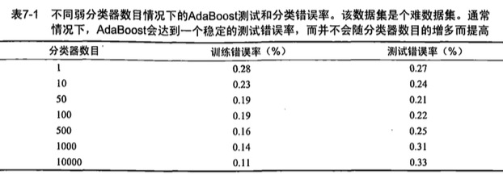

观察上表，我们会发现测试错误率在达到了一个最小值之后又开始上升了。这类现象称之为**过拟合(overfitting)**

很多人都认为，AdaBoost 和 SVM 是监督机器学习中最强大的两种方法。实际上，这两者之间拥有不少相似之处。我们可以把弱分类器想象成 SVM 中的一个核函数，也可以按照最大化某个最小间隔的方式重写 AdaBoost 算法。而它们的不同就在于其所定义的间隔计算方式有所不同，因此导致的结果也不同。

## 非均衡分类问题

前面所有提到的分类介绍中，我们都假设所有类别的分类代价是一样的。可是在大多数情况下不同类别的分类代价并不相等
