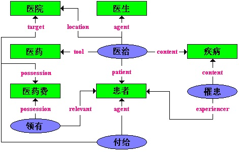

# 知网

_董振东 董强_

知网（英文名称为HowNet）是一个以汉语和英语的词语所代表的概念为描述对象，以揭示概念与概念之间以及概念所具有的属性之间的关系为基本内容的常识知识库。

<!-- MarkdownTOC -->

- 1. 问题的提出
- 2. 知网的哲学
- 3. 知网的特色
- 4. 知网建设的方法
    - 4.1 义原的提取
    - 4.2 义原的考核与确定
- 5. 知网系统的概貌
    - 5.1 知网系统包括下列数据文件和程序：
    - 5.2 知识词典的记录样式
        - 5.2.1 词语及其概念的选择
        - 5.2.2 关于词语的例子
- 6. 概念定义的标注方法和规定
    - 6.1 总规定
    - 6.2 细节规定
        - 6.2.1 关于事件类概念的规定
        - 6.2.2 关于属性值和数量值类概念的规定
        - 6.2.3 关于属性和数量类概念的规定
        - 6.2.4 关于单位类概念的规定
        - 6.2.5 关于事物的规定
- 7. 关于事件类概念
- 7.1 主要特征之间的关系
    - 7.2 必要角色框架
- 8. 关于事物类概念
- 9. 结论

<!-- /MarkdownTOC -->

## 1. 问题的提出

1988年前后，董振东曾在他的几篇文章中提出以下的观点：

1. 自然语言处理系统最终需要更强大的知识库的支持。
2. 关于什么是知识，尤其是关于什么是计算机可处理的知识，他提出：知识是一个系统，是一个包含着各种概念与概念之间的关系，以及概念的属性与属性之间的关系的系统。一个人比另外一个人有更多的知识说到底是他不仅掌握了更多的概念，尤其重要的是他掌握了更多的概念之间的关系以及概念的属性与属性之间的关系。
3. 关于如何建立知识库，他提出应首先建立一种可以被称为知识系统的常识性知识库。它以通用的概念为描述对象，建立并描述这些概念之间的关系。
4. 关于由谁来建立知识库，他指出知识掌握在千百万人的手中，知识又是那样博大精深，靠三、五个人甚至三、五十个人是不可能建成真正意义上的全面的知识库的。他提出：首先应由知识工程师来设计知识库的框架，并建立常识性知识库的原型。在此基础上再向专业性知识库延伸和发展。专业性知识库或称百科性知识库主要靠专业人员来完成。这里很类似于通用的词典由语言工作者编纂，百科全书则是由各专业的专家编写。

知网的研究和建设是实践上述观点的努力。

---

## 2. 知网的哲学

要掌握和利用好知网系统，必须首先了解知网系统的哲学思想。知网系统的哲学也就是它对客观世界的认识与把握。知网哲学的根本点是：世界上一切事物（物质的和精神的）都在特定的时间和空间内不停地运动和变化。它们通常是从一种状态变化到另一种状态， 并通常由其属性值的改变来体现。试以人为例，人的生老病死是一生的主要状态。这个人的年龄（属性）一年比一年大｛属性值｝，随着年龄的增长头发的颜色（属性）变为灰白｛属性值｝。另一方面，一个人随着年龄的增长他的性格（精神）变得日益成熟｛属性值｝，他的知识（精神产品）愈益丰富｛属性值｝。基于上述，知网的运算和描述的基本单位是：万物，其中包括物质的和精神的两类，部件，属性，时间，空间，属性值以及事件。

特别要强调的是，部件和属性，这两个基本单位在知网的哲学体系中占有着重要的地位。关于对部件的认识是：每一个事物都可能是另外一个事物的部件，同时每一个事物也可能是另外一个事物的整体。门和窗是建筑物的部件；手和脚是动物的部件。但与此同时，一个建筑物又可能是一个社区的部件；一个人又可能是他所属的家庭或社会的部件。一切事物都可以分解为部件。空间可以分解为上下左右；时间可以分解为过去、现在和未来。没有一种事物只能是部件，而不能是整体；也没有一种事物只能是整体，而不会是部件。我们认为一个事物被视为是整体还是部件，可以因系统的不同，而不同对待。关于部件在整体中的部位和它的功能，知网遵循这样一种认识：事物的部件在它整体中的部位和功能的描述大体上比照人体。例如：山头、山腰、山脚、桌腿、椅背、河口，建筑物的门和窗比照人体的口和眼等等。汉语用拟人的手法来描述部件，别的语言也类似，这反映了人类认识事物方法的共性。

关于对属性的认识是：任何一个事物都一定包含着多种属性，事物之间的异或同是由属性决定的，没有了属性就没有了事物。人有种族、肤色、性别、年龄、性格、会思维、会使用语言等自然属性以及国籍、出身、职业、贫富等社会属性。在某些特定的情况下可以说属性比事物更重要，这一点在人们的日常生活的替代活动中可以得到体现。如：当我们要把一个钉子钉到墙上，但我们没有锤子，于是我们要找锤子的替代物，那么什么是锤子的替代物呢？那应该是属性最接近锤子的属性的物品才可能是替代物，而这时重量和硬度是关键性的属性。属性和它的宿主之间的关系是固定的，这是说有什么样的宿主就有什么样的属性，反之亦然。属性与宿主之间的关系同部件与整体之间的关系是不同的。这也体现在知网在涉及属性的标注规范上，知网规定在标注属性时必须标注它可能的宿主的类型。知网还规定在标注属性值时都必须标注它所指向的属性。

---

## 3. 知网的特色

计算机化是知网的重要特色。知网是面向计算机的，是借助于计算机建立的，将来可能是计算机的智能构件。

知网作为一个知识系统，实副其名是一个网而不是树。它所着力要反映的是概念的共性和个性，例如：对于“医生”和“患者”，“人”是它们的共性。知网在主要特性文件中描述了“人”所具有的共性，那么“医生”的个性是他是“医治”的施事，而“患者”的个性是他是“患病”的经验者。对于“富翁”和“穷人”，“美女”和“丑八怪”而言，“人”是它们的共性。而它们的个性，即：“贫”、“富”与“美”、“丑”等不同的属性值，则是它们的个性。

同时知网还着力要反映概念之间和概念的属性之间的各种关系。知网把下面的一种知识网络体系明确的教给了计算机进而使知识对计算机而言是可操作的。

总的来说，知网描述了下列各种关系：

1. 上下位关系 (由概念的主要特征体现，请参看《知网管理工具》)
2. 同义关系（可通过《同义、反义以及对义组的形成》获得）
3. 反义关系（可通过《同义、反义以及对义组的形成》获得）
4. 对义关系（可通过《同义、反义以及对义组的形成》获得）
5. 部件-整体关系（由在整体前标注 % 体现，如"心"，"CPU"等）
6. 属性-宿主关系（由在宿主前标注 & 体现，如"颜色"，"速度"等）
7. 材料-成品关系（由在成品前标注 ? 体现，如"布"，"面粉"等）
8. 施事/经验者/关系主体-事件关系（由在事件前标注 * 体现，如"医生"，"雇主"等）
9. 受事/内容/领属物等-事件关系（由在事件前标注 $ 体现，如"患者"，"雇员"等）
10. 工具-事件关系（由在事件前标注 * 体现，如"手表"，"计算机"等）
11. 场所-事件关系（由在事件前标注 @ 体现，如"银行"，"医院"等）
12. 时间-事件关系（由在事件前标注 @ 体现，如"假日"，"孕期"等）
13. 值-属性关系（直接标注无须借助标识符，如"蓝"，"慢"等）
14. 实体-值关系（直接标注无须借助标识符，如"矮子"，"傻瓜"等）
15. 事件-角色关系（由加角色名体现，如"购物"，"盗墓"等）
16. 相关关系（由在相关概念前标注 # 体现，如"谷物"，"煤田"等）

知网的一个重要特点是：类似于同义、反义、对义等种种关系是借助于《同义、反义以及对义组的形成》由用户自行形成而不是逐一地、显性地标注在各个概念之上的。

知网是一个知识系统，而不是一部语义词典。尽管被我们称为知识词典的常识性知识库是知网的最基本的数据库。知网的全部的主要文件包括知识词典构成了一个有机结合的知识系统。例如，主要特征文件、次要特征文件、同义、反义以及对义组的形成，以及事件关系和角色转换等都是系统的重要组成部分，而不仅仅是标注的规格文件。我们预计用户将来把它们与知识词典一起加以利用。

---

## 4. 知网建设的方法

知网是一个以上述各类概念为描述对象的知识系统。知网不是一部义类词典。知网是把概念与概念之间的关系以及概念的属性与属性之间的关系形成一个网状的知识系统。这是它与其他的树状的词汇数据库的本质不同。知网的哲学和它的根本特性决定了它的特别的建设方法。

### 4.1 义原的提取

什么是义原，跟什么是词一样的难以定义。但是也跟词一样并不因为它难于定义人们就无法把握和利用它们。大体上说，义原是最基本的、不易于再分割的意义的最小单位。例如：“人”虽然是一个非常复杂的概念，它可以是多种属性的集合体，但我们也可以把它看作为一个义原。我们设想所有的概念都可以分解成各种各样的义原。同时我们也设想应该有一个有限的义原集合，其中的义原组合成一个无限的概念集合。如果我们能够把握这一有限的义原集合，并利用它来描述概念之间的关系以及属性与属性之间的关系，我们就有可能建立我们设想的知识系统。利用中文来寻求这个有限的集合，应该说是个捷径。中文中的字（包括单纯词）是有限的，并且它可以被用来表达各种各样的单纯的或复杂的概念，以及表达概念与概念之间、概念的属性与属性之间的关系。

我们的方法的一个重要特点是对大约六千个汉字进行考察和分析来提取这个有限的义原集合。以事件类为例，在中文中具有事件义原的汉字（单纯词）中我们曾提取出3200个义原。试以下面为例我们得到了9个义原但其中有两对是重复应予合并。

    治：医治 管理 处罚 ……
    处：处在 处罚 处理 ……
    理：处理 整理 理睬 ……

3200个事件义原在初步合并后大约可以得到1700个，然后我们再进一步加以归类，我们便得到大约700多个义原。请注意，到现在为止完全不涉及多音节的词语。然后我们用这700多个义原作为标注集去标注多音节的词，当我们发现这700多个义原不符合或不满足要求时，我们便进行的合理调整或适当扩充。这样就形成了今天的800多个事件义原的标注集以及由它们标注的中文的事件概念。

综上所述，知网的建设方法的一个重要特点是自下而上的归纳的方法。它是通过对全部的基本义原进行观察分析并形成义原的标注集，然后再用更多的概念对标注集进行考核，据此建立完善的标注集。

### 4.2 义原的考核与确定

在初步确定了一批义原并形成了一个基本的标注集之后，如何加以考核和确定？

第一、在扩大标注中观察该义原的覆盖面。我们有一条原则：我们已有的义原一定要能够描述全部的概念。这里有一个比较硬性的规定，即当我们发现一个具有多个概念的词语，例如八个，而我们以有的义原不能够把这八个概念区别开来时，我们就必须对我们的标注集加以调整，这是绝大多数的情况。在很个别的情况下我们不排除怀疑其中某个概念是否存在，以决定取舍。

第二、观察某一个义原在概念之间关系中的地位。如果一个义原在同类别的许多概念中出现或者不同类别的概念中出现，那么这样的义原就是稳定的义原是一个必须确定的义原。以事件类“医治”这个义原为例，它不仅出现在“医”、“治”、“治疗”、“医疗”、“治病”、“求医”、“看病”等概念中，并且还出现在“医生”、“医院”、“医药”、“诊所”、“不治之症”、“有病乱投医”。因此，“医治”这个义原是稳定的、是必须确定的。

无论是义原的提取还是义原的考核与确定，在知网的建设中都是至关重要的和具有决定意义的。它们贯穿于知网建设的全过程。因此，知网建设的方法的主要特点是：（1）自下而上的；（2）标注集的形成和知网建设是互动的。

---

## 5. 知网系统的概貌
　
### 5.1 知网系统包括下列数据文件和程序：

1. 知网管理系统
2. 中英双语知识词典

知网的规模主要取决于双语知识词典数据文件的大小。由于它是在线的，修改和增删都很方便，因此它的规模是动态的。它的规模通常以词语的条数以及由词语所表述的概念的条数计算。

### 5.2 知识词典的记录样式

知识词典是知网系统的基础文件。在这个文件中每一个词语的概念及其描述形成一个记录。每一种语言的每一个记录都主要包含4项内容。其中每一项都由两部分组成，中间以“=”分隔。每一个“=”的左侧是数据的域名，右侧是数据的值。它们排列如下：

    W_X= 词语
    E_X= 词语例子
    G_X= 词语词性
    DEF= 概念定义

#### 5.2.1 词语及其概念的选择

《知网》的知识词典是以词语及其概念为基础的。我们是怎样选择和确定词语及其概念的呢？ 这里要回答以下几个问题

第一，我们不认为汉语有很严格的、如印欧语言那样的"词"。因此知识词典的描述的最基本单位，不必要去追求严格的关于词的定义。我们选择词语的依据是建立于4亿字汉语语料库按出现频率形成的词语表，而不是仅仅依据某一本现成的词典。知识词典很注意收集已经流行又有较固定可能的词语，如"因特网"、"欧元"、"二恶英"、"下载"、"点击"、"黑客"等，但又不盲目求新，如不收"打的"。

第二，词语的概念或称义项的选择也是经过精心考虑的。一般很注意某一义项的现代的流通性。例如"曹"在普通词典中至少有两个义项，一是"姓"，另一是"辈"如用于"尔曹"。而知识词典只选择第一个义项。

第三，我们同时给出了与词语相对应的英文释义。我们的目的是体认知识词典对概念的描述方法是否也适用于另一种语言。按理是应该能够适合的。我们的目的当然不是为最终用户提供普通的汉英词典。

#### 5.2.2 关于词语的例子

迄今为止，我们主要是为那些具有多个义项提供例子。这些例子的要求是：强调例子的区别能力而不是它们的释义能力。它们的用途在于为消除歧义提供可靠的帮助。这里试以"打"的两个义项为例，一个义项是"buy|买"，另一个是"weave|辫编"。

    NO.=000001
    W_C=打
    G_C=V
    E_C=~酱油，~张票，~饭，去~瓶酒，醋~来了
    W_E=buy
    G_E=V
    E_E=
    DEF=buy|买

    NO.=015492
    W_C=打
    G_C=V
    E_C=~毛衣，~毛裤，~双毛袜子，~草鞋，~一条围巾，~麻绳，~条辫子
    W_E=knit
    G_E=V
    E_E=
    DEF=weave|辫编

设我们要判定的歧义语境是"我女儿给我打的那副手套哪去了"。我们通过对"手套"与"酱油"等的语义距离的计算以及跟"毛衣"等的语义距离的计算的比较，我们将会得到一个正确的歧义判定结果。这种方法的好处有二：第一，多数的判定可以避免采用规则； 第二，多数的情况基本的算法可以是不依赖特定语言的。

填写例子是一项具有研究性质的工程。这项工作是由国家语委97@YY001课题支持的，由北京大学中文系部分师生承担的。迄今为止还没有全部完成。另外，我们需要资助者的同意才可以全部公布。我们在第二版中只给出前三个字母的多义词语的例子，以飨读者。

---

## 6. 概念定义的标注方法和规定

知网对概念的描述是要着力体现概念与概念和概念的属性与属性之间的相互关系，因此，知网对于概念的描述必然是复杂的。这就必须有一套明确的规范，否则便无法保证描述的复杂度和描述的一致性。概念描述既有总的、一般性的描述，也有因不同类别的细节性描述。

但是，描述的方法和规定又必须保证能够最大限度地表现概念与概念和概念的属性与属性之间的相互关系。事实证明满足复杂性和一致性统一的要求的可行途径是设计一种知识词典的描述语言。知网建设的过程也是设计与建立这样的描述语言的过程。迄今为止，知网的知识词典的描述语言（Knowledge Dictionary Mark-up Language，KDML）包含下列几部分：

1. 它的词汇近1500个特征及动态角色；
2. 标识符号和标点；
3. 词序；

### 6.1 总规定

1. 任何一个概念的DEF项是必须填写的，不得为空。
2. DEF项中用以定义的特性至少是一个，但也可以是多个，数量没有限制，只要内容是合理的且形式是合乎规范的。
3. DEF项的第一位置所标注的必须是知网所规定的主要特征（详见《知网管理工具》），否则视为语法错误。但是有些关系意义，可以把次要特征置于{}中后，作为第一位置标注。例如一些介词、连词等虚词，严格地说它们本身没有概念意义
4. 多个特征之间应以英文逗号“,”分隔，且逗号与特征之间没有空格。
5. 除第一位置以外，其他位置也可以填有主要特征，但应该说明的是，当主要特征在非第一位置时它失去了原有的上下位关系。
6. DEF项中任何一个位置上的信息都可以带有知网所规定的标示符号。

### 6.2 细节规定
　
#### 6.2.1 关于事件类概念的规定

1. DEF项的第一位置只能是事件类文件所规定的主要特征；
2. 对于那些以事件为中心的复杂概念的标注则应遵循如下规定：

(a) 应利用动态角色来标注复杂概念，因为所谓的复杂概念多半是除了事件中心本身以外还有一个或一个以上的动态角色，例如：

    严禁：包含动态角色——方式 (manner)
    贷款：包含动态角色——所有物 (possession)
    盗墓：包含动态角色——来源 (source)
    救灾：包含动态角色——原状态 (StateIni)
    呼救：包含动态角色——内容 (content)

(b) 在表示上述动态角色时它的书写格式是：动态角色名称 = 主要特征或次要特征，例如“救灾”的标注应为：

    DEF=rescue|救助,StateIni=unfortunate|不幸

更为复杂的例子如：“扭亏为盈”

    DEF=alter|改变,StateIni=InDebt|亏损,StateFin=earn|赚

#### 6.2.2 关于属性值和数量值类概念的规定

1. “属性值”是所有属于属性值概念的唯一的主要特征，“数量值”是所有属于数量值概念的唯一的主要特征，因此他们分别是两类概念的首位标识；
2. 属性值概念和数量值概念除首位标识外必须还包含有一个次要特征。在第二位上一定要标注该属性值或数量值所指向的属性或数量特征；
3. 通常绝大多数情况下在第三位置上标注该属性值或数量值的具体值；

例如：

    美味：DEF=aValue|属性值,taste|味道,good|好
    八成：DEF=qValue|数量值,amount|多少,many|多
    巨大1：DEF=aValue|属性值,size|尺寸,big|大
    巨大2：DEF=QValue|数量值,amount|多少,many|多
    大量1：DEF=aValue|属性值,tolerance|气量,generous|慷
    大量2：DEF=QValue|数量值,amount|多少,many|多

#### 6.2.3 关于属性和数量类概念的规定

1. “属性”是所有属于属性概念的唯一的主要特征，“数量”是所有属于数量概念的唯一的主要特征，因此他们分别是两类概念的首位标识；
2. 所有属性或数量概念都必须借助“&”标注其宿主的类型；

例如：

    味道：DEF=attribute|属性,taste|味道,&edible|食物
    气量：DEF=attribute|属性,tolerance|气量,&human|人
    班次：DEF=quantity|数量,amount|多少,&transport|运送
    比价：DEF=quantity|数量,rate|比率,&price|价格

6.2.2和6.2.3两节的叙述具体的体现了知网哲学的关于概念关系的观点。这种观点简单的说是：事物包含属性而成为其宿主，属性必有一定的属性值体现。

#### 6.2.4 关于单位类概念的规定

1. 单位通常是指“米”、“公里”、“吨”等，对于中文而言还包含中文所特有的名量和动量；
2. 跟属性类一样，除在首位标注的是单位、名量或动量外，还必须借助“&”标注其指向的属性或事物的类型；

例如：

    公里：DEF=unit|单位,&length|长度
    本：DEF=NounUnit|名量,&publications|书刊
    次：DEF=ActUnit|动量,&event|事件

#### 6.2.5 关于事物的规定

1. 所谓事物包含下列的概念类型：物质（包括有生命和无生命）、精神（包括情感、欲望、思想、经验）、时间、空间、事情以及它们的部件。这里应该强调说明的是知网中所描述的“事情”，实际上也是事件。关于这方面的问题我们将在第七节中详细讨论。
2. 知网对于事物类概念的标注的规定较为琐细，不同类的概念有着不同的要求。大体上，应注意到两个方面，其一采用适合的标识符号；其二是多位标识之间的顺序。
3. 当我们要标注某概念所具有的特定的属性值时可以将此属性值直接标注，而无须借助于任何标识符号。例如：
    + 男士：DEF=human|人,male|男
    + 高手：DEF=human|人,able|能,desired|良
    + 难题：DEF=problem|问题,difficult|难,undesired|莠
4. 关于部件类概念的规定。第二位标识必须借助于“%”指明其所属的整体的类型，并尽可能标注它在整体中的部位或它的功能，如：
    + 心脏：DEF=part|部件,%AnimalHuman|动物, heart|心
    + CPU：DEF=part|部件,%computer|电脑, heart|心
    + 这样的标注意味着“心脏”和“CPU”的分别是“动物”和“电脑”的部件，同时“动物”和“电脑”又分别是“心脏”和“CPU”的整体。它们的功能都是整体的“心”。就常识而言如果“心”的功能受损，那么其整体的功能也必受损。这有助于推理。
5. 当标注某一概念与事件之间的关系时，应遵循下列规定：
    + 当此概念本身是事情时，其首位标识自然为“事情”，一般应在第二位上标注它应属于的事件的主要特征，无须借助于标识符号，如：
        + 拔河：DEF=fact|事情,exercise|锻练,sport|体育
    + 当此概念与事件之间存在一定的动态角色关系时，则必须借助于标识符号，如：
        + 雇主：DEF=human|人,*employ|雇用
        + 雇员：DEF=human|人,$employ|雇用
        + 熨斗：DEF=tool|用具,*AlterForm|变形状,#level|平
        + 假期：DEF=time|时间,@rest|休息,@WhileAway|消闲
        + 旅馆：DEF=InstitutePlace|场所,@reside|住下,#tour|旅游
        + 救生艇：DEF=ship|船,*rescue|救助
    + 如果此概念与事件存在更复杂的动态角色关系时，则必须借助于多标识符号和多标识位，这时有顺序的要求，如：
        + 洗衣机：DEF=tool|用具,*wash|洗涤,#clothing|衣物
            + 上例中“洗涤”为“用具”的功能，或该“用具”用于“洗涤”，“衣物”借助于“#”表示其为“洗涤”的受事。他们之间的顺序是不可以颠倒的。又如：
        + 熨斗： DEF=tool|用具,*AlterForm|变形状,#level|平
            + 这里“平”是“变形状”的受事属性，这就是说，“变形状”的受事在接受了该事件之后，其属性将有变化，以至于获得一个“平”的属性值。

综上所述，相信读者已经对知识词典描述语言(KDML)有了较详尽的了解。应该说，这种描述语言会随着知网的发展而完善，以获得表达能力更强的、语法更严密的描述语言。

---

## 7. 关于事件类概念

事件的主要特征可在《知网管理工具》中看到。其总数800以上，占整个知网特征总数的一半以上，足以见得事件类概念的重要以及知网对事件类概念的重视。上述文件中每一个主要特征附有一个必要角色框架，置于“{}”中，还有一个“[]”其中也标有各种特征。角色框架和置于“[]”中的各种特征为事件类概念的共性的次要特征。

## 7.1 主要特征之间的关系

知网认为事件概念粗略可以做这样的分类

知网通过自下而上的事件概念的逐一考察，认定事件的主要特征之间的关系有三类：

1. 上下位关系
2. 静与动的对应关系
3. 动态相互感应关系

上下位关系在上述文件中已清楚列出。

下面先讨论静与动的对应关系。关系和状态是属于上述静态之下的两类。上述动态之下的两类即泛动和实动是造成关系和状态的动力。这样就形成了知网所称的静与动的对应关系，简单的说，有什么样的关系或有什么样的状态，就有什么样的行为动作。例如事物之间有领属关系，如：“我有书”表明了“我”和“书”的关系。 与之相对应的、可以改变这种领属关系的行为动作则是“取”或“给”。

知网认定事件中表示关系的有九类，事件中表示状态的分为物质状态和精神状态两大类。物质状态包括：存现、常态、良态、衰态、消失（如：生物的生、老、病、死）。精神状态包括：情感、态度、欲望、认知。知网认定事件中表示行为动作的都是与上述关系和状态一一对应的，归根结底体现一个“变”字，即变关系和变状态。需要提请注意的有两类：一是变具体属性的行为动作，如：“提高”、“降低”、“美化”、“加温”等；二是变使动或制动的行为动作，如：“使”、“让”、“命令”、“静止”等。粗略的看这两类行为动作与关系或状态没有具体的一一对应的关系，但是实际上它们也是变关系或状态的。任一个实体，当其属性改变的时候，如由冷变热（在“加温”的作用下），就是其自身内在状态的变化。任一实体，当在使动或制动的行为动作的作用下发生某种行为或停止某种行为，都是其与外界关系的变化。为使读者获得一个宏观的把握，我们把知网事件主要特性的骨架显示如下:

具体不赘述，可以参考[知网自己的介绍](http://www.keenage.com/zhiwang/c_zhiwang.html)
　
关于动态相互感应关系，简称互感关系。事件的互感关系体现在两个方面。第一，事件与事件之间的互感关系；第二，事件的动态角色的相互转换关系。

事件与事件之间的互感关系包括同类的（都是静态的或者都是动态的），也包括跨类的。例如，"有"和"丢失"是同类的，它们之间的关系前者为后者的必要前提，若"无"，便不可能"丢失"。再如，"买"和"有"是不同类的，它们之间的关系则是前者为后者的前提。又如，"抱歉"和"道歉"是不同类的，前者是静态的，一种感情状态，后者是动态的，是一种表达感情的行为动作，但它们存在着一种内在的关系，后者为前者的逻辑结果。"罹患"、"医治"和"复原"是不同类的，"罹患"和"复原"是静态的，"医治"是动态的。它们之间的关系是"医治"转化"罹患"这个"衰态"到"复原"这个"良态"。

事件动态角色相互转换关系说的是在某一事件发生时它的动态角色会自然地转化成为另一事件的动态角色，或者它原来就应该是另一事件的某一个动态角色。例如，“买”的施事将转化为“有”的“关系主体”。又如，“患病”的经验者原来就应该是“医治”的受事。“医治”的受事将转化为“康复”的经验者。

### 7.2 必要角色框架

在知网中，800个事件主要特征中的每一个都标识有一个角色框架。知网所规定的动态角色载于文件"动态角色与属性"。在框架中所列出的角色是该主要特征的必要绝对角色，这就是说，少了其中的一个，该事件将不成立。我们特别提请注意：这里说的是当某一类事件发生时框架中的全部必要角色都将参与，这与实际的语言中是否出现并无关系，例如："买"这一事件发生时，必要绝对角色是：谁（施事）买，买什么（领属物），从哪（来源）买，付多少钱（代价），为谁（受益者）买。又如："同情"这一事件发生时，必要绝对角色是：谁（经验者），同情谁（对象），因为什么（原因）。在《概念的主要特征(1)》中，它们被分别规定如下：

    buy |买 {agent,possession,source,cost,~beneficiary}
    pity |怜悯 {experiencer,target,cause}

诚然在实际语言中在一句话中把上述角色都表达出来时不多见的，但不表达并不等于不存在。由于任何一个事件的发生都是在特定的时间与空间中，因此我们在必要角色框架中没有列入时间和空间。

必要角色框架体现了事件的共性。因此，在知网的建设中它也成为判定概念的重要依据。例如，“致歉”这一概念在判定它是属于“抱歉”这一类，还是“道歉”这一类时，如果我们利用必要角色框架就比较容易判定。“致歉”和“道歉”一样，它们都可以有“对象”这一动态角色。再例如，“呼救”这一概念为什么我们判定它的主要特性是“呼喊”而不是“救助”是因为它不会具备“救助”的动态角色框架，“呼救”的主要特征是“呼喊”，而“救”是“呼喊”的动态角色框架中的“内容”一项。

---

## 8. 关于事物类概念

事物的主要特征也可在《知网管理工具》中看到。。这些主要特征被组织成一个层级框架体现它们的上下位关系。事物类层次较浅，知网对于事物类的描述主要是要体现它们的共性和个性。每一个主要特征的共性在文件中置于“[]”中。而概念的个性则逐一的标注在个别的概念的DEF中。

## 9. 结论

知网的研究与建设前后经历了十多年的时间，作者体会其最困难部分是：

1. 确定主要特征和次要特征，以及对它们的组织；
2. 确定描述的方法和建立概念的描述语言；
3. 逐一地标注概念，而其总量又应在50000以上；

知网的研究与建设不仅有很高的探索性，而且有很强的工程性。我们相信它作为一种知识资源能够得到广泛的应用。

知网的今后发展会在四个方面进行：

1. 增加已有语种的概念总量
2. 扩充至其他的语种
3. 优化知识词典描述语言(KDML)，强化其描述能力
4. 挑选一个小范围的专业知识领域进行专业知识库建立的实验

以上讲的是知网自身的发展，当然更重要的应该是它的推广和应用。这就是为什么我们要把它放在网上的原因。
