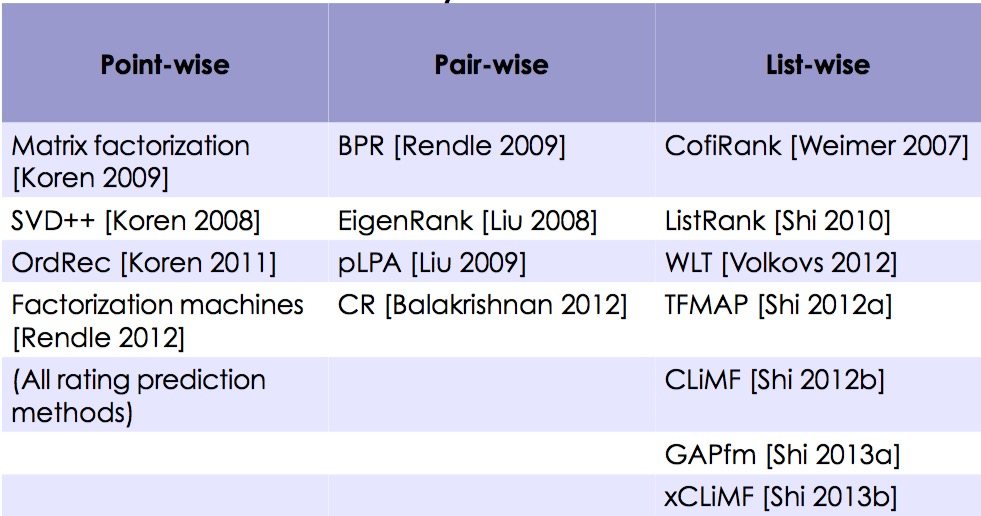
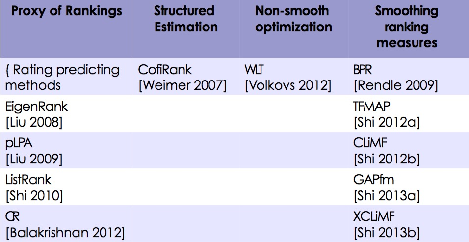
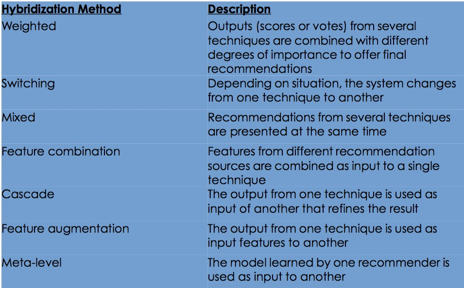

# Machine Learning for Recommender Systems

<!-- MarkdownTOC -->

- The "Recommender Problem"
- A good recommendation
- Approaches to Recommendation
- What works?
- Collaborative Filtering
    - Performance Implications
    - Memory based CF
    - The Sparsity Problem
    - Personalised vs Non-Personalised CF
- Model Based CF Algorithms
    - Restricted Boltzmann Machines
    - Learning to Rank
    - Recurrent Neural Networks for CF
    - Clustering
    - Association rules
- Limitations of CF
    - Cold Start
- Content-Based Recommendations
    - Content-based Methods
    - Content-based User Profile
    - Similarity Measurements
- Context-aware Recommendations
    - Context in Recommendations
- Ranking
    - Ranking: Approaches
    - Learning to rank
    - Metrics
    - Top-k Ranking
- Learning to Rank for IR & ML
- Social and Trust-based recommenders
    - Major Algorithms - Networks
- Hybrid Recommender Systems
    - Weighted
    - Feature Combination
    - Switching
    - Mixed
    - Cascade
    - Feature Augmentation
- Beyond Explicit
- Personalized Learning to Rank
- Context-aware Recommendations
- User choice and presentation effects
- Social Recommendations
- Conclusions

<!-- /MarkdownTOC -->

## The "Recommender Problem"

Estimate a **utility function** to **predict** how a user will **like** an item.

C := {users}

S := {recommendable items}

u := utility function, measures the usefulness of item s to∈ user c

    u : C x S -> R

    where R:={recommended items}

For each user c, we want to choose the items s that maximize

∀c ∈ C, s~c~' = argmax(u(c, s)) s ∈ S

## A good recommendation

+ is relevant to the user
+ is diverse: represents all the possible interests of one user
+ Does not recommend items the user already knows or would have found anyway
+ Expands the user's taste into neighboring areas. **Serendipity** = Unsought finding

## Approaches to Recommendation

Recommendations are based on:

+ Users' **past** behavior(Collaborative Filtering - CF):
    + Find similar users to me and recommend what they liked(**Momory-based**)
    + Model taste patterns in large amounts of user-item interactions(**Model-based)
+ Item features(Content-based)
+ Users' features(Demographic)
+ Social recommendations(Trust-based)

## What works?

+ Depends on the **domain** and particular problem
+ Currently, the best approach is **Collaborative Filtering**
+ Other approaches can be combined to improve results
+ What matters?
    + **Data preprocessing**: outlier removal, denoising, removal of global effects
    + **Combining methods**

## Collaborative Filtering

The task of **predicting**(filtering) user preferences on new items by **collecting** taste information from many users(collaborative).

Challenges:

+ many items to choose from
+ very few recommendations to propose
+ few data per user
+ no data for new user
+ very large database

用矩阵表示的话，会很稀疏，稀疏矩阵的表示与计算

### Performance Implications

+ User-based similarity is more **dynamic**. Precomputing user neighbourhood can lead to poor predictions.
+ Item-based similarity is **static**. We can precompute item neighbourhood. Online computation of the predicted ratings.

### Memory based CF

Pros:

+ Requires minimal knowledge engineering efforts
+ Users and products are symbols without any internal structure or characteristics
+ Produces good-enough results in most cases

Cons:

+ Requires a large number of explicit and reliable "ratings"
+ Requires standardized products: users should have bought exactly the same product
+ Assumes that prior behaviour determines current hehaviour without taking into account "contextual" knowledge

### The Sparsity Problem

+ Typically large product sets & few user ratings
+ CF must have a number of users ~ 10% of the product catalogue size

Methods for dimensionality reduction

+ Matrix Factorization
+ Clustering
+ Projection(Principal Component Analysis)

### Personalised vs Non-Personalised CF

+ CF recommendations are **personalized**: the prediction is based on the ratings expressed by **similar users**; **neighbours** are **different** for each target user.
+ A **non-personalized** collaborative-based recommendation can be generated by averaging the recommendations of **ALL** users
+ How would the two approaches compare?

Use Mean Average Error(MAE)

## Model Based CF Algorithms

Models are learned from the underlying data rather than heuristics.

Develop a model of user ratings:

+ Bayesian network (probabilistic)
+ Clustering (classification)
+ Association rules
+ Other models:
    + linear regression
    + probabilistic latent semantic analysis

### Restricted Boltzmann Machines

+ A (generative stochastic) Neural Network
+ Learns a probability distribution over its inputs
+ Used in dimensionality reduction, CF, topic modeling, feature learning
+ Essential components of Deep Learning methods (DBN's, DBM's)

May need further investigation

+ Each unit is in a state which can be active or not active
+ Each input of a unit is associated to a weight
+ The transfer function calculates for each unit a score based on the weighted sum of the inputs
+ This score is passed to the activation function which calculated the probability that the unit state is active

### Learning to Rank

+ Usually we care to make accurate ranking and not rating prediction
+ Square loss optimizes to accurately predict 1s and 5s
+ RS should get the top items right -> Ranking problem
+ Why not to learn how to rank directly
+ Learning to Rank methods provide up to 30% performance improvements in off-line evaluation

### Recurrent Neural Networks for CF

+ RNN's are Neural Networks designed to model sequences
+ RNN for CF tries to predict the next item given all previous ones
+ RNN's model the current output as a function of the previous ouput and a hidden (latent) state
+ RNN models the items

### Clustering

+ Cluster customers into categories based on preferences & past purchases
+ Compute recommendations at the cluster level: all customers within a cluster receive the same recommendations

### Association rules

Pros:

+ Fast to implement
+ Fast to execute
+ Not much storage space required
+ Not **indiviudal** specific
+ Very successful in broad applications for large populations, such as shelf layout in retail stores

Cons:

+ Not suitable if preferences change rapidly
+ Rules can be used only when enough data validates them. False associations can arise

## Limitations of CF

+ Cold Start:
    + It needs to have enough users in the system
    + New items need to get enough ratings
+ Sparsity:
    + It is hard to find users who rated the same items
+ Popularity Bias:
    + Cannot recommend items to users with unique tastes
    + Tends to recommend popular items

### Cold Start

+ **New User Problem**: the system must first learn the user's preferences from the ratings.
    + Hybrid RS, which combines content-based and collaborative techniques, can help
+ **New Item Problem**: Until the new item is rated by a substantial number of users, the RS is not able to recommend it

## Content-Based Recommendations

+ Recommendations are based on the information on the content of items rather than on other users' opinions.
+ Use a machine learning algorithm to model the users' preferences from examples based on a description of the content.

In Content-Based Recommendations, the recommended items for a user are based on the profile built up by analysing the content of the items the user has liked in the past.

+ Suitable for text-based products(web pages, books)
+ Items are "described" by their features (e.g. keywords)
+ **Users** are described by the keywords in the items they bought
+ Recommendations based on the match between the content (item keywords) and user keywords
+ The user model can also be a **classifier (Neural Networks, SMV, Naive Bayes...)

Pros:

+ No need for data on other users
+ No cold-start or sparsity problems
+ Can recommend new and unpopular items
+ No first-rater problem
+ Can provide explanations of recommended items by listing content-features that caused an item to be recommended

Cons:

+ Only for content that can be encoded as meanningful features
+ Some types of items (e.g. movies, music) are not amendable to easy feature extraction methods
+ Even for texts, IR techniques cannot consider multimedia information, aesthetic qualities, download time: a positive rating could be not related to the presence of certain keywords
+ Users' tastes must be represented as a learnable function of these content features
+ Hard to exploit quality judgements of other users
+ Difficult to implement serendipity

### Content-based Methods

+ Content(s) := item profile, i.e. a set of attributes/keywords characterizing item s
+ weight w~ij~ measures the **Importance** (or **informativeness**) of word k~j~ in document d~j~
+ term frequency/inverse document frequency(TF-IDF) is a popular weighting technique in IR

### Content-based User Profile

+ ContentBasedProfile(c) := profile of user c
+ profiles are obtained by:
    + analysing the content of the previous items
    + using keyword analysis techniques

e.g., ContentBasedProfile(c) := (wc~1~,...,wc~k~)

a vector of weights, where wc~i~ denotes the importance of keyword k~i~ to user c

### Similarity Measurements

In content-based systems, the utility function u(c,s) is defined as:

    u(c,s) = score(ContentBasedProfile(c), Content(s))

where ContentBasedProfile(c) of user c and Content(s) of document s are both represented as TF-IDF vectors of keyword weights.

Utility function u(c,s) usually represented by some scoring heuristic defined in terms of vecotrs, such as the cosine similarity measure.

## Context-aware Recommendations

+ Context is a dynamic set of factors describing the state of the user at the moment of the user's experience
+ Context factors can rapidly change and affect how the user perceives an item

### Context in Recommendations

+ Temporal: Time of the day, weekday/end
+ Spatial: Location, Home, Work etc.
+ Socila: with Friends, Family

**Recommendations** should be tailored to the user & to the current **Context** of the user.

Pre-filtering

+ Simple
+ Works with large amounts of data
+ Increases sparseness
+ Does not scale well with many Context variables

Post-filtering

+ Single model
+ Takes into account context interactions
+ Computationally expensive
+ Increases data sparseness
+ Does not model the Context directly

Tensor Factorization & Factorization Machines

+ Performance
+ Linear scalability
+ Models context directly

## Ranking

+ Most recommendations are presented in a sorted list
+ Recommendation is a ranking problem
+ Popularity is the obvious baseline
+ Users pay attention to few items at the top of the list

### Ranking: Approaches

+ Re-rank: based on features e.g. predicted rating, popularity, etc
+ Learning to Rank: Build Ranking CF models

### Learning to rank

+ Machine learning task: Rank the most relevant items as high as possible in the recommendation list
+ Does not try to predict a rating, but the order of preferences
+ Training data have partial order or binary judgments (relevant/not relevant)
+ Can be treated as a standard supervised classification problem

### Metrics

Metrics evaluate the quality of a recommendation list

**Normalized Discounted Cumulative Gain NDCG**

Mean Reciprocal Rank(MRR) / Mean Average Precision(MAP)

+ Point-wise
+ Pari-wise
+ List-wise

### Top-k Ranking

+ Focus on the very top of the recommendation list since users pay attention only to the first k items
+ Top heavy ranking measures put much more emphasis at the top of the list(e.g. MRR, MAP, NDCG)
    + Drop in measure non-linear with the position in the list
+ AUC gives the same emphasis to the top as to the bottom of the list
    + Drop in measure linear to the position in the list

## Learning to Rank for IR & ML

Query-document (Q-D) retrieval: Given a query, rank documents

Features of a Q-D pair(relevance label) -> Learn a ranking function -> Predict relevances of new Q-D

Analogy: Query-doc --- User-item

+ RankSVM
+ LambdaRank
+ RankNet
+ RankBoostAdaRank
+ ListNet
+ SVM-MAP
+ SoftRank

Reciprocal Rank(RR): The inverse of the rank of the first relevant item in a given list.

## Social and Trust-based recommenders

+ A social RS recommends items that are "popular" with the friends of the user.
+ Friendship though does not imply **trust**
+ "Trust" in social-based RS can be per-user or topic-specific

### Major Algorithms - Networks

+ Advogato(Levien)
+ Appleseed(Ziegler and Lausen)
+ MoleTrust(Massa and Avesani)
+ TidalTrust(Golbeck)

Building Recommender Systems Using Trust

+ Use trust as a way to give more weight to some users
+ Trust for collaborative filtering
    + Use trust in place of (or combined with) similarity
+ Trust for sorting and filtering
    + Prioritize information from trusted sources

Other ways to use Social

+ Social connections can be used in combination with other approaches
+ In particular, "friendships" can be fed into collaborative filtering methods in different ways.
    + e.g. replace or modify user-user "similarity" by using social network information

## Hybrid Recommender Systems

### Weighted

+ Rating for an item is computed as the weighted sum of ratings produced by a pool of different RS
+ The weights are determined by training and get adjusted as new ratings arrive
+ Assumption: relative performance of the different techniques is uniform. Not true in general: e.g. CF performs worse for items with few ratings

e.g.

+ P-Tango RS: a CB and a CF recommender equally weighted at first. Weightes are adjusted as predictions are confirmed or not.
+ RS with consensus scheme: each recommendation of a specific item counts as a vote for the item.

### Feature Combination

CF ratings of users are passed as additional feature to a CB. CB makes recommendations over this augmented data set

### Switching

+ The system uses a criterion to switch between techniques
+ The main problem is to identify a good switching criterion

e.g.

The DailyLearner system uses a CB-CF. When CB cannot predict with sufficient confidence, it switches to CF.

### Mixed

Recommendations from more than one technique are presented together

e.g.

+ The PTV system recommends a TV viewing schedule for the user by combining recommendations from a CB and a CF system
+ CB uses the textual descriptions of TV shows; vs CF uses other users' preferences
+ When collision occurs, the CB has priority

### Cascade

+ At each iteration, a first recommendation technique produces a coarse ranking & a second technique refines the recommendation
+ Cascading avoids employing the second, lower-priority, technique on items already well-differentiated by the first
+ Requires a meaningful ordering of the techniques

e.g.

EntreeC is a restaurant RS uses its knowledge of restaurants to make recommendations based on the user's stated interests. The recommendations are placed in buckets of equal preference, and the collaborative technique breaks ties.

### Feature Augmentation

+ Very similar to the feature combination method:
    + Here the output of one RS is incorporated into the processing of a second RS

e.g.

+ Amazon.com generates text data("related authors" and "related titles") using its internal collaborative systems
+ Libra system makes content-based recommendations of books based on there text data found in Amazon.com, using a naive Bayes text classifier

## Beyond Explicit

+ Implicit feedback is more readily available, and less noisy
+ Already many approaches (e.g. SVD++) can make use of implicit feedback
+ Ongoing research in combining explicit and implicit feedback

论文

+ Large scale online bayesian recommendations, 2009
+ OrdRec: an ordinal model for predicting personalized item rating distributions, 2011
+ Factorization meets the neighborhood: a multifaceted collaborative filtering model, 2008
+ Collaborative Filtering for Implicit Feedback Datasets, 2008

## Personalized Learning to Rank

Better approaches to learning to rank that directly optimize ranking metrics and allow for personalization (e.g. CliMF & TFMAP)

+ CLiMF: learning to maximize reciprocal rank with collaborative less-is-more filtering, 2012
+ TFMAP: optimizing MAP for top-n context-aware recommendation, 2012

## Context-aware Recommendations

+ Beyond the traditional 2D user-item space
+ Recommendations should also respond to user context(e.g. location, time of the day...)
+ Many different approaches such as Tensor Factorization or Factorizaion Machines

论文

+ Multiverse recommendation: n-dimensional tensor factorization for context-aware collaborative filtering, 2010
+ Fast context-aware recommendations with factorization machines, 2011

## User choice and presentation effects

+ We log the recommended items to the users and their choice
+ We can use this information as negative feedback(not chosen) and positive feedback(chosen)

论文

Collaborative competitive filtering: learning recommender using context of user choice, 2011

## Social Recommendations

+ Beyond trust-based
+ Cold-starting with Social Information
+ Combining Social with CF
+ Finding "experts"

论文

+ Socially Enabled Preference Learning from Implicit Feedback Data, 2013
+ Wisdom of the better few: cold start recommendation via representative based rating elicitation, 2011
+ Trustwalker: a random walk model fro combining trust-based and item-based recommendation, 2009
+ New objective functions for social collaborative filtering, 2012
+ On top-k recommendation using social networks, 2012

## Conclusions

+ Recommender Systems(RS) are an important application of Machine Learning
+ RS have the potential to become as important as Search is now
+ However, RS are more than Machine Learning
    + HCI
    + Economical models
    + ...
+ RS are farly new but already grounded on well-proven technology
    + Collaborative Filtering
    + Machine Learning
    + Content Analysis
    + Social Network Analysis
    + ...

