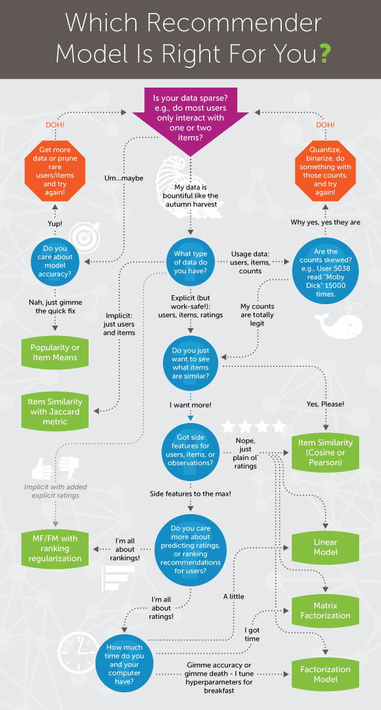

# 选择合适的推荐系统模型

我们的机器学习工程师一直忙于构建GraphLab farm。这篇博客针对一个特殊的应用难题：怎样从 GraphLab Create recommender toolkit 的众多模型和选项中选择一个合适的推荐模型。

这完全取决于你现有的数据类型以及你评估结果的方式。

（注意：这里使用的是GraphLab Create 0.9 的API。GraphLab Create 1.0 支持通过recommender.create() 来智能选择推荐模型。你可以通过 1.0 的API文档查看recommender toolkit中模型的最新说明。此外，这个论坛列出了从版本0.9.1到版本1.0的API变动。）

如果你的数据是隐性的，也就是数据中仅有用户和物品间的交互信息（没有用户对物品的打分），那么，你可以选择使用Jaccard相似度的 `ItemSimilarityModel`。

    # 当数据中仅包含'user_id'和'item_id'两个属性的时候
    # recommender.create 方法会自动选择
    # `method=‘item_similarity’` and `similarity_type=’jaccard’`
    >>> itemsim_jaccard_model = graphlab.recommender.create(data)

当数据为隐反馈时，你可以通过增加一个均为1的目标列把数据伪装成显性数据。若要构建追求排序性能的模型，请见下文。

如果数据是显性的，也就是观测数据中包含用户的真实评分，那么你可以从多个模型中选择。使用cosine或Pearson相似度的ItemSimilarityModel可以包含评分信息。此外，`MatrixFactorizationModel`（矩阵分解模型）、`FactorizationModel`（分解模型） 以及 `LinearRegressionModel`（线性回归模型） 都支持评分预测。

    # 此时数据中包含 3 列，‘user_id’，‘item_id’ 以及 ‘rating’
    >>> itemsim_cosine_model = graphlab.recommender.create(data,
           target=’rating’,
           method=’item_similarity’,
           similarity_type=’cosine’)
    >>> factorization_machine_model = graphlab.recommender.create(data,
           target=’rating’,
           method=’factorization_model’)

如果你的目标是提高排序性能，你可以在设置 `ranking_regularization` 的情况下使用 ItemSimilarityModel（物品相似度模型）、MatrixFactorizationModel（矩阵分解模型） 、 FactorizationModel（分解模型）。排序正则化选项设置后会随机地选取一些未观测数据并把它们的目标评分设成一个偏负面的值。`ranking_regularization` 值在0到1之间。该值越大，负样本的权重也就越大。如果你想使用 分解模型来处理隐反馈数据，你应该首先给 SFrame 增加一列全为1的值把它变成显性数据，再将 `unobserved_rating_value` 设为 0 来运行排序正则化。这里明确地设定 `unobserved_raint_value` 是有必要的，因为模型默认把未知评分设为已知评分的 5% 分位数；当所有已知评分均为 1 时，它们的 5% 分位数也是 1，不能把它作为未知评分的目标值。

    # 数据中包含一列真实的评分
    >>> ranking_regularization_model = graphlab.recommender.create(data,
           target=’rating’,
           method=’matrix_factorization’,
           ranking_regularization=1.0)

    # 数据中包含一列“伪造”的评分，全部为 1
    >>> rr_model_for_implicit_data = graphlab.recommender.create(data,
           target=’rating’,
           method=’matrix_factorization,
           ranking_regularization=1,
           unobserved_rating_value=0)

如果你想对评分数据进行评分预测，那么选择MatrixFactorizationModel, FactorizationModel, or LinearRegressionModel的任意一个。从统计学的角度看，这三个模型都是明确地对评分建模的回归模型。换句话说，观测评分被建模为一些项的加权组合，其中权重（包括一些项，也被成为因子）通过训练数据得到。这几个模型都可以很方便地引入用户或物品特征。

    # 当数据包含一列目标值时，默认的方法是 matrix_factorization
    >>> matrix_factorization_model = graphlab.recommender.create(data,
           target=’rating’)
    >>> linear_model = graphlab.recommender.create(data,
           target=’rating’,
           method=’linear_model’)
    >>> factorization_machine_model = graphlab.recommender.create(data,
           target=’rating’,
           method=’factorization_model’)

LinearRegressionModel 假设评分是用户特征、物品特征、用户偏置、物品流行度偏置的线性组合。MatrixFactorizationModel 和 FactorizationModel 还可以引入两个向量的内积项，其中一个向量表示用户对一组隐性特征的喜好程度，另一个向量表示物品对这组隐性特征的包含程度。这些通常被称为隐性因子并且可以从观测数据中自动学习得到。FactorizationModel （分解模型）较 MatrixFactorizationModel（矩阵分解模型） 更进一步， 考虑到了这些隐性因子与边际特征的交互影响。一般来说，FactorizationModel（分解模型） 最有效，但也最难训练（由于它的威力和灵活性）。LinearRegressionModel（线性回归模型） 最简单，训练速度也最快，但没有考虑用户物品间的交互作用。

我们建议你从 MatrixFactorizationModel（矩阵分解模型） 开始，如果这个模型运行时间过长，可以降级使用 LinearRegressionModel（线性回归模型）。或者，如果你认为需要使用二阶交互项来加强模型，可以升级使用 FactorizationModel（分解模型）。注意，这些模型都带有几个正则化参数如：`n_factors` 和 `regularization`，这些参数会影响测试时的预测精度。这对于 FactorizationModel（分解模型） 尤为有用。建议你使用超参数搜索函数 graphlab.`toolkits.model_params_search()` 来调整这些参数。

    # 这里强调了回归模型中一些有用的参数选项
    >>> custom_mf_model = graphlab.recommender.create(data,
           target=’rating’,
           n_factors=20,
           regularization=0.2,
           linear_regularization=0.1)
    >>> custom_fm_model = graphlab.recommender.create(data,
           target=’rating’,
           method=’factorization_model’,
           n_factors=50,
           regularization=0.5,
           max_iterations=100)
    >>> custom_linear_model = graphlab.recommender.create(data,
           target=’rating’,
           method=’linear_model’,
           regularization=0.01)

如果目标评分是二值的，也就是它们的值是赞或踩标签，在使用回归模型（LinearRegressionModel, MatrixFactorizationModel, FactorizationModel）时，设置输入参数`binary_targets = True`。

    >>> logistic_regression_model = graphlab.recommender.create(data,
           target=’rating’,
           method=’linear_model’,
           binary_targets=True)

使用MatrixFactorizationModel（矩阵分解模型） 和 FactorizationModel （分解模型）训练得到的隐性因子可以作为特征用于其他的任务。在这种情形下，使用非负因子有利于提高可解释性。简单地使用`nmf=True`作为输入参数，分解类型的模型就会学习非负因子。

    >>> nmf_model = graphlab.recommender.create(data,
           target=’rating’,
           method=’matrix_factorization’,
           nmf=True)

已有数据？数据问题？

最后，有几个影响推荐系统性能的常见数据问题。第一，如果观测数据非常稀疏，也就是仅包含大量用户的一个或两个观测数据，那么任何一个模型都不会比 popularity 或 item_means 这些基准模型效果好。这种情况下，将稀疏用户和物品剔除后重试也许有用。另外，重新检查数据收集和清理过程，看错误是否源于此处。尽可能对每个用户每个物品获取更多的观测数据。

另一个经常会遇到的问题是把使用数据当做评分。与显性评分位于一个很好的线性区间（例如，[0, 5]）不同，使用数据可能被严重扭曲。例如，在 Million Song 数据集中，一个用户播放一首歌超过 16000 次。所有的模型都很难应对这种严重扭曲的目标。解决的方法是对使用数据进行归类。例如，把播放次数超过 50 次映射成最高评分 5 。你也可以把播放次数转成二进制，例如播放超高两次的为 1，反之为 0。

好吧，都记住了吗？是的，我们一半都记不住。下面这幅粗略的信息图一目了然地显示了所有的提示。愉快地探索吧，勇敢地推荐系统研究者！

