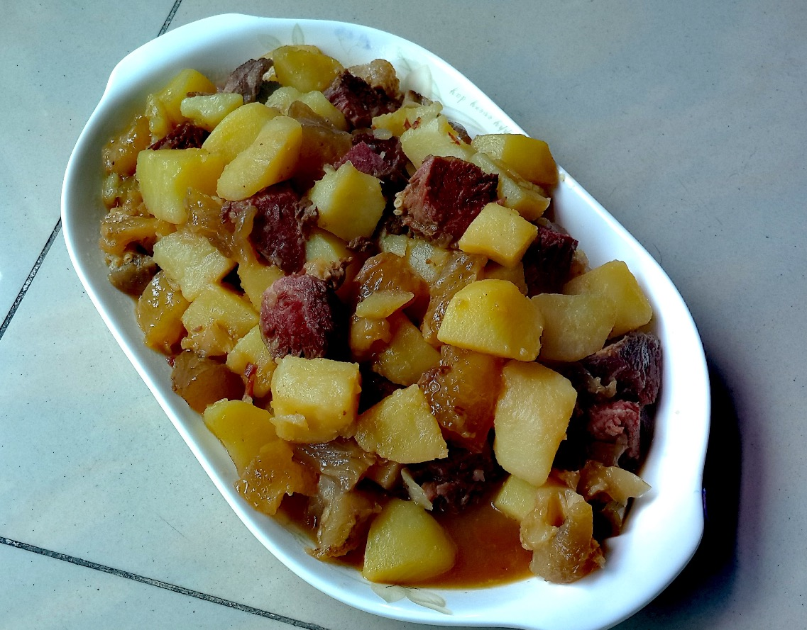

# 土豆炖肉

作为业余土豆爱好者，自从在北京开发出来了具有个人特色的花式土豆吃法之后，我的体重就像之前都股市一样根本停不下来了，老干妈土豆泥，土豆炖牛肉，土豆炖排骨，土豆炖培根，简单粗暴易做好，一下能吃两三天，简直是在外搬砖居家必备。转眼过去了两年，做得多了慢慢也就有了感觉，搜了一下好像没有能写出我心意的文章，于是就自己来写写。

说起土豆炖肉，其实重点有三个：土豆、肉和味道。理想状态下这道菜应该是这样的：土豆起沙，入口即化；肉酥软，肉汁充盈；刺激香味，咸口，咽下去有回甘。无论是当主菜还是拌饭吃，都足以成为餐桌上的主角。一般来说做这个菜的话，只需另外搭配点素材，一家人就可以美美吃一顿了。

先说说味道，我觉得家常菜跟味道相关的要点有二，一是少油，再是少调料。油大了不健康，而且家里的锅也达不到饭馆的火力，没办法充分发挥油多的优势。调料如果太复杂，自己租房子的时候要配各式各样可能不常用的调料，也是挺麻烦的事情。于是我做的时候，只放三种调料：冰糖、蒸鱼豉油、胡椒粉。冰糖不用太多，但是一定要煮到土豆和肉里面去，这样在一开始蒸鱼豉油的咸鲜过后，正好在下咽的时候能感受到冰糖的甜味，就起到了咸和甜互相提振，一加一大于三的效果。至于胡椒粉嘛，个人口味，在咸和甜之间混入特别异域风情的味道(主要是闻起来)，是非常别致的体验。

然后来说说土豆和肉的选择，土豆其实基本就正常买，不长芽不太生略粉即可，最好挑表面比较平滑的，方便去皮和切块。切块的时候一定要注意均匀，这样才能保证入味的程度一致。肉的话有点讲究，我图省事儿一般是用超市里已经调味及腌制好的牛肉、牛蹄筋。如果是从生肉开始，那么在正式做菜之前，可能还需要一些额外的处理，比方说泡水去血色(牛腩)、过水焯一下去浮渣(排骨、牛腩等，表面稍微收缩即可)。如果想要颜色好看一点，就开油锅，小火熬糖色，再加入香料和调味料爆炒小火煮。如果更有空，还可以先煎一下，不但可以定型，还能封住肉汁。

炖肉炖肉，最重要的其实是温度。一开始一定要大火，因为肉在温水中泡太久，会变得很劲很难嚼，所以要用最大火力尽快把温度提上去。肉在50度蛋白质凝结，60-65度会突然收缩，放出大量肉汁，而到了70度结缔组织开始溶化，这时候小火炖煮，就可以让肉变酥变软，并且失去的肉汁会重新被吸入到肉里面。最后收收汁，肉香和土豆香融为一体，起锅，上菜！

肉类的选择，其实也有讲究，根据寒热属性不同，有对应的搭配。比方说牛羊肉属于温热性，那么搭配上辛香味道(胡椒粉的作用)，对于体虚的人有好处；而鸡肉(其实飞禽大多是)性大热，最好需要搭配一些阴寒的食物(如蘑菇)，所以东北名菜小鸡炖蘑菇，就是绝配了；日常肉类中，猪肉比较特别，性寒滋阴，所以要配上热性佐料或者用火火火烹饪，猪头肉蘸蒜泥，葱烧爆肚还有火爆腰花，都是这个道理；鸭肉和猪肉类似，要么夏天吃，要么就烤来处理。

这样想想，用业余的水平来要求的话，其实当个好厨师不难，一个原则：简单加平衡。简单的意思是通过了解不同食材的不同属性，尽量凸显出其本身的风味，而不是用各式各样的调料来喧宾夺主。平衡的意思是根据不同食材的不同属性，通过寒热组合和烹饪方式来尽量中和过于极端的性质(例如性大寒或性大热)。了解这两点，多多实践，再找一个你做得再难吃也愿意笑着骂着吃完的人，过不了多久就可以出师了。

跟着自己的舌头走，总没错。
