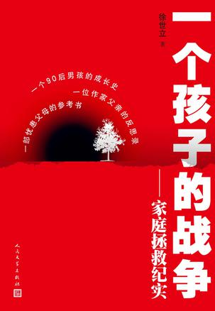

#【一个孩子的战争】把一个人完整地还给他自己

整理书架的时候无意中看到了这个颇为特别的书名，原以为是讲童子军什么的，翻开一看没想到是讲家庭教育的。说来奇怪，一直来我对如何教育孩子都非常感兴趣，好好好，首先。。。不要在意这些细节。一般来说这类书都是介绍如何成龙成凤的经验的，但是这本不一样，从问题少年出发，反而更能击中要害：爱是一种氛围，不是一种权力。

作者文人出身，细腻敏感溢于言表，加上近五百页的篇幅，看到后面就一个感觉：矫情。用比较时髦的话说就是内心戏太多，再加上笔墨渲染夸张一下，就更觉得天都要塌下来了，我倒是觉得作为父亲，完全可以酷一点，有些话嘛，点到为止即可。孩子刚出生到四岁半是爷爷奶奶带大的，这种隔代亲很容易出问题，因为更多是爷爷奶奶用肆无忌惮的爱去满足自己，并不是从孩子的长远发展出发的，究其根本，爱之中必定需要包含责任，没有责任约束的爱，容易走火入魔。

独生子女，万千宠爱于一身，宠爱的背后，是无数的期望和压力，背负了太多原本并不应该属于我们的东西，精于算计，亦步亦趋，活着活着，就成了所谓的精致的利己主义者。我一直在想，圈养和放养之间，有没有第三条路，让我们绕开脆弱的心理，不再逃避。

我觉得一定有。家庭教育其实是一个互相教育的过程，父亲凝聚为强硬核心，告诉孩子如何与自己相处，母亲氤氲成柔软外层，教会孩子如何与世界相处。言传不可少，身教则更为重要，孩子可能比打人更有洞察力。

既然是互相教育，多多沟通和讨论就是必不可少的了，不能用成年人过来人的经验去限制孩子的成长，而是应该支持与引导。需要引导什么呢？其实跟修行非常相似，有意思的是，功夫熊猫恰好就非常贴合主题。就借着台词，来说说我作为一个孩子的感悟吧。

> We all have our places in the world.

要引导孩子培养独立的人格，不妄自菲薄，也不刚愎自用。

> No news are good or bad.

为自己做的事情负责，这样无论对错，都可以去尝试，别人也会反复信任你。事情发生了就是发生了，是好是坏，只取决于之后你怎么做。

> You just need to believe. You must believe.

要自信，无论在多么困难的情况下，都要信任自己，从小事情开始，一点一点建立自己的信心储备。一个没有信心的人，是不可能有自我的，一个没有自我的人，是可悲的。

> You must continue your journey without me.

讲清楚个中利害关系，把解决问题的权力交回给孩子，毕竟这条路要一个人走，这是父母能做到的，开放和信任。

> We are not trying to stop you, but coming with you.

惩罚是容易的，但是教育是重要的，父母是同路人，引导孩子去探索、发现和理解自己以及这个世界，而不应该成为阻碍。

> Internal peace, harmony and foucs.

当你顺其自然归于平静的时候，答案自会清晰可见。人越大方就越放松，就越容易相处。心灵是自由的，人就是自由的

> One often meets his destiny on the road he takes to avoid it.

不要逃避，生活不是全赢，一次次跌倒的过程，就是在慢慢唤醒心中沉睡的自己。

练字、阅读、写作和运动，配上引导、信任、理解与支持，也许这就是第三条路。相信在这种爱的氛围下，能真正把一个人完整地还给他自己。

还记得飞越疯人院里的护士长吗？不要成为那样的人。

