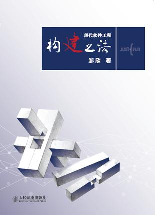

# 【构建之法】人件

只要是在微博上关注了邹欣老师的同学，一定会发现《构建之法》这本书出现得频率极高，而且和教学实践紧密结合，老师和同学在微博上互动，不但能起到鼓励和监督的作用，更重要的是，通过社交网络把这种教学理念转播出去，让更多人意识到，也许老师和学生本应是另一种模式。

答辩完成之后就快速浏览了一遍这本书，对于软件工程的方方面面都有涉及，重点在对于背后原因的讲解，具体的技术细节并没有做过多纠缠，这是非常正确的选择。技术细节就应该在实践中由同学们慢慢摸索，这之前老师的任务就是帮同学们大致画个地图，至少在茫茫丛林中，有那么点方向感。每一章节最后丰富的参考源以及拓展阅读部分，仅此一点就能看出老师的用心，再加上设计合理接地气的习题，相信认真学过这门课的同学，都会有很大的收获。

真为他们感到高兴，能遇到这么靠谱的好老师。但是即使没有也不要太悲伤，至少还有这本书嘛，仔细看看，然后和同学讨论思考一下习题，也会有不一样的收获。不过这里提一个建议，就是最好像 CSAPP 一样标注好解答每一题大致需要的时间，这样更方便做学习计划。

书中的很多内容，对于学生来说可能实际操作的意义不大，因为毕竟在比较宽松的环境做比较简单的项目，但是知道这些概念即可，总有一天或多或少会用上的，不要担心。书中提到的四种类型的项目很有意思：

+ Build To Learn：开发软件，构建系统的目的是做进一步的试验，试图发现客观规律或探求某方法的优劣。这些项目经常是科研论文的基础工作。
+ Build To Show：为了突出地展现某个技术的作用，开发一些以演示为目的的软件，这些项目很吸引眼球，经常获得新闻报道，但是功能未必全面。
+ Build To Serve：为了服务一定范围的目标用户而构建的工具等，有时以公开SDK的形式发布。
+ Build To Win：以在市场上赢得用户为目标而构建的软件。这也是种种科学发现、技术突破最好的试金石。

对于我们来说，可能 Build To Learn 是最重要的，毕竟纸上得来终觉浅。正是带着这种学习的心态，敢于失败，或者说就是去找失败，摸爬滚打中学习，才是记得最牢的，遇到困难本能能想到的方法。

然后介绍了微软 Program Manager 这个职务，因为自己本身去实习过，读起来就特别有亲切感，其中关于成为合格 PM 的四个能力也非常靠谱：

1. 观察、理解和快速学习能力。PM要能够在一个新的领域中很快上手。就好像刚开始实习的时候，我需要在一周的时间里弄清楚 Bing 整个的架构和工作流程，方便之后的工作开展。面对一个全新的东西(虽然之中的技术可能见过)，如何能够快速在脑子里搭建好一个模型，就很重要了。
2. 分析管理能力。每天项目中发生的事情千头万绪，PM要能够分析出重点，找到优先级，做判断、做决定。这一点我的感触更多是从我的 mentor 和整个 team leader 身上得来的。对面大大小小的会议，需要在很短的时间里(当然很多问题会前需要准备)做出具体的判断。如果没有清晰的头脑和果敢的判断，这份工作会很辛苦。而业余时间多读书多体验，是增加经验和判断的好方法，比方说我的 mentor 喜欢研究红楼梦，而 team leader 喜欢潜水和跳伞，我想这些都对他们的工作有很大的帮助。
3. 一定的专业能力。如果一定要说专业能力的话，PM的专业就是理解和表达，你能否理解不同人的心理、需求和言外之意？你能否借助文字、图表、草图，甚至代码来清晰准确地表达自己的想法？PM 要始终能满怀激情地向用户兜售产品，向团队兜售希望。PM通常也能写代码，能玩转Excel、PPT、Visio、甘特图，会PS，有文字功底，写的博客有人爱读，反正，总得有几招绝活吧！不用说还要有大量的阅读，对IT行业、用户心理、社会都要有广泛的了解。(看到这一段，我觉得 PM 简直是为我量身定做的职位，懂技术会表达能代码能写文顺带还读了点书)
4. 自省的能力。一个PM做第一个项目时可以拍脑袋定工期，拍胸脯打包票，最后拍屁股走人（谁没年轻过呢），但是失败之后要有自省和自我改进的能力。这个和第二项其实非常关联，因为既然有判断，就一定会有失误，那么能不能从失误，甚至从正确判断中学习和改进，就决定了你能走多远了。

总体来说，这本书啥都有，如果想要做软件相关，但是又不大想写太多代码的话，就看看这本书吧。
