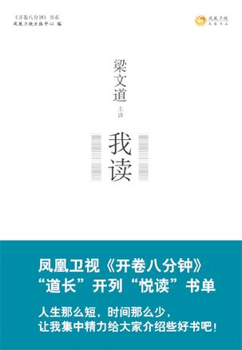

# 【我读】书评卖钱

这个系列可不得了，就凭一句『梁文道的书单』，估计大家就心里长草想着买买买了。一套六册，每册有几个主题，每个主题下有一系列书，每一本书对应一篇书评，有长有短，错落有致。比方说我喜欢的基地系列，就整整吹了十来页，虽然有些看法不一致，但是总体思路差不多。强行和文化人凑一波，也是不容易。

于是我就想，哪天出名了，我也可以攒攒这里的书评，凑几本小册子挣点零花钱。说起这个，韩寒的做法就挺好，书里的内容其实博客里基本都有，虽然明摆着是『骗钱』，但是还是心甘情愿支持一下。不过一连看六本这样的书单推荐，还真是有点心累。于是我就在想，究竟处于什么境界的人，适合看这种书籍推荐的书呢？

首先当然是初学者，刚刚走进书的世界，必定是迷茫的，有个引路人画个地图指个方向，总是不错的。当然了，也可以选择不管不顾，因为看得够多，好的坏的都见过，自然就有了方向感。初学者看这类书，因为和作者的阅读交集太少，往往难以理解作者的深层含义，而沦为按图索骥。可是按图索骥在读书上也不是什么坏事儿，重点在于『索』，去『索』的话，即使图不是百分百正确，也会有很多收获。

其次是看了一阵子书，却有点不得其道的同学。就感觉什么书都看了一点，但是看了一点好像又没有什么用，这时候怎么办？也简单，找一本感兴趣的，书单上也有的书，自己也写写书评，和作者的比较比较，看看差在哪里，对症下药即可。

最后是看了很多书的，那么这类书更像是和朋友聊天，彼此交流一下读书心得感悟，激发一些新的灵感和想法。

这么看来，好像书评卖钱这事儿，对于各种层次的读者都有好处。那么问题就来了，什么样的书评才能卖钱呢？我觉得要满足以下几个条件：

1. 首先必须是认真看完之后写的才行，书没读完就写，有点不负责任
2. 要有自己的想法，用简短的语言描述清楚作者的观点态度，然后就转自己的思考
3. 所谓思考应该设计纵向横向两个方面，让读者明白这本书为什么好为什么坏哪里好哪里坏
4. 最好是写值得看的书，而不是不值得看的书，除非这种错误非常典型

六册的书单我整理了一下，可以在[这里](https://github.com/wdxtub/WDXpeak/blob/master/List/books-recommended-by-famous-people.md)看到。书评卖钱的标准还是很高的，我得好好努力哈哈。
