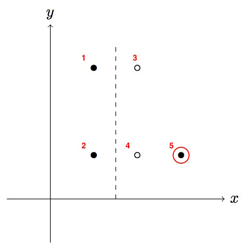
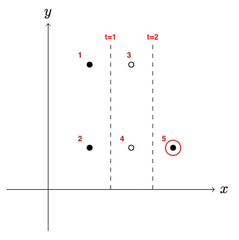

# 1 Boosting

## 1.1 Initial Weight

The initial weight assigned to each data is $\frac{1}{5}$

## 1.2 Updated Weights

Assuming the rightmost black dot is the 5th data.

Initial Weight: $D(1)=(\omega_{11},\omega_{12},...,\omega_{15}) = (0.2,0.2,0.2,0.2,0.2)$

With the first decision stump we have 1 error point.

Training error $\epsilon_1=\frac{1}{5}=0.2$

So $\alpha_1=\frac{1}{2}ln\frac{1-\epsilon_1}{\epsilon_1}=0.5ln4=0.6931$

Normalization factor $Z_1=\sum_{i=1}^{m}D_1(i)exp(-\alpha_1y_ih_1(x_i))=0.1+0.1+0.1+0.1+0.4=0.8$

Updated Weight: $D_2(i)=\frac{D_1(i)exp(-\alpha_1y_ih_1(x_i))}{Z_1}$

We have: $D(2)=(0.125,0.125,0.125,0.125,0.5)$

The one with the red circle will have an increased weight in the next boosting iteration.

## 1.3 Final Desicion Boundary

No. It is impossible to achieve zero training error. For the second iteration, the decision stump will be as followed:

Suppose -1 means BLACK and 1 means WHITE. 

When t=1, $h_1(x)$ classifies the left as BLACK(-1) and right as WHITE(1)

When t=2, $h_2(x)$ classifies the left as WHITE(1) and right as BLACK(-1)

The training error for $h_2(x)$: $\epsilon_2=\frac{0.5+0.5}{4}=0.25$

So $\alpha_2=\frac{1}{2}ln\frac{1-\epsilon_2}{\epsilon_2}=0.5ln3=0.5493$

Normalization factor $Z_2=\sum_{i=1}^{m}D_2(i)exp(-\alpha_2y_ih_2(x_i))=(0.2165,0.2165,0.0722,0.0722,0.2887)$

Classifier $H(x)=sign(\alpha_1h_1(x)+\alpha_2h_2(x))=sign(0.6931h_1(x)+0.5493h_2(x))$

Notice that for point 5, the final classifier will still classify it as WHITE.

