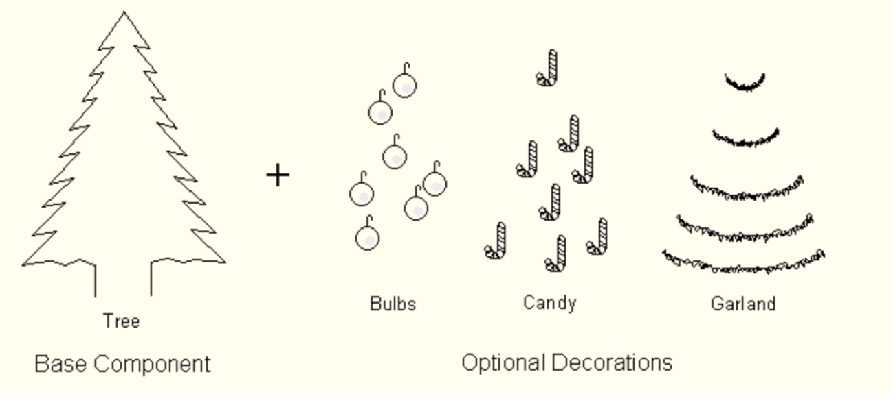

# Week 10 Assignment

Andrew Id: dawang

Name: Da Wang

> Does the following code fragment implement the Factory Method design pattern? Explain why.

```java
public class XMLReaderFactory {
    // This method returns an instance of a class
    // that implements the XMLReader interface.
    // The specific class it creates and returns is
    // based on a system property.
    public static XMLReader createXMLReader();
}

public interface XMLReader {
    public void setContentHandler(ContentHandler handler):
    public void parse(InputStream is);
}
```

Answer:

Yes, the code fragment implements the Factory Method. As the XMLReaderFactory class will create object that implement the XMLReader interface based on a system property. It satisfied the definition of Factory Method design pattern.

> Typically, there is a significant performance penalty for declaring a method synchronized. In general adding the keyword synchronized to a method slows the invocation of the method by a factor of 6. A common programming idiom used to avoid synchronization in the common case is double check locking. Can the double-check locking idiom be used with the singleton pattern to avoid synchronizing every time the static instance method is called? For example, is the following valid? Explain why.

```java
public class Singleton {
    private Singleton() { }
    static private Singleton instance = null;
    static public Singleton instance() {
        // Double check locking idiom
        // The synchronization is done internally 
        // rather than on the method. This avoids
        // the expense of synchronizing for the
        // common case.
/*12*/  if( instance == null ) {
            synchronized( Singleton.class ) {
                // Second check
                if( instance == null ) {
/*16*/               instance = new Singleton( );
                 }
            }
        }
/*20*/  return instance;
    }
}
```

Answer:

For most cases, the code works well. Using lazy initialization to get better performance and only when it needs to be locked shall we use the synchronized method.

However, a better practice is to use `volatile` keywords.

> Consider the following scenario, please suggest a design pattern and implement it. The outcome should like this:


In Elizabeth's day care center, the teacher helps the kids to build all kinds of toys to develop their creative skills. One of Elizabeth's favorite activities is to make animals with play-dough.

A set of molds is the tool that Elizabeth always uses to create her favorite cool animals.

One mold tool set includes five parts, including the head, body, arm, leg, and tail. Whenever Elizabeth wants to build an animal, she will use one set of each tools to make a head, body , leg, arm, and tail for that animal, and then assembles them with glue to build an animal. There are many types of animal mold tool sets that the kids can choose from.

For example: if Elizabeth wants to make a monkey, then she will pick the set of monkey molds to start.

+ Step 1. Make monkey head.
+ Step 2. Make monkey body.
+ Step 3. Make monkey leg.
+ Step 4. Make monkey arm.
+ Step 5. Make monkey tail.

Once all the five parts are finished, then Elizabeth will glue them all together and decorate it to have a monkey done as a finished product. Most likely, she will give it to her mom as a gift when she picks her (she will not give her the monkey if the monkey is not decorated, since it will not be looking good at all then). When she wants to make a kitten, she follows the same steps with the set of Kitten molds.

Answer:

I choose Builder Pattern for this situation.

One possible implementation is:

```java
public interface Part {
    public String name();
}

public class Head implements Part {
    @Override
    publis String name(){
        return "Head has been built";
    }
}

public class Head implements Part {
    @Override
    publis String name(){
        return "Head has been built";
    }
}

public class Leg implements Part {
    @Override
    publis String name(){
        return "Leg has been built";
    }
}

public class Arm implements Part {
    @Override
    publis String name(){
        return "Arm has been built";
    }
}

public class Tail implements Part {
    @Override
    publis String name(){
        return "Tail has been built";
    }
}

public class Toy {
    private List<Part> parts = new ArrayList<>();
    private String name;
    
    public Toy(String t){
        System.out.println("Elizabeth starts making a " + t);
    }
    
    public void addPart(Part p){
        parts.add(p);
        System.out.println(name + "'s " + p.name());
    }
}

public class ToyBuilder {
    public Toy prepareToy(String t){
        Toy toy = new Toy(t);
        t.addPart(new Head());
        t.addPart(new Body());
        t.addPart(new Leg());
        t.addPart(new Arm());
        t.addPart(new Tail());
    }
}

```

> You are working on software that interacts with a new hardware device and are anxious to test against the actual hardware. The hardware manufacture has a beta version of the driver they plan to release but is warning the interface of the device driver could change between now and the release date. The device driver is used throughout your code and you are concerned about writing code to an interface that is subject to change. What design pattern can be used to mitigate the risks involved? Describe what the risks are and how the design pattern mitigates these risks.

Answer:

Adapter Pattern should work well in this situation. It is a structural pattern to combine two independent interface.

When the interface of the hardware changes, I don't have to modify my core code. What I need to do is to make some modification on the adapter part to fit the new interface. In that case, I can make my core code stable.

> In keeping with the holiday theme, use the Decorator design pattern to model a Christmas tree as a base component (the tree) and optional decorations or adornments such as bulbs, candy and garland. Initially it's enough for your solution to model just the printing or display of the tree along with its adornments. You can also assume that each type of decoration is added all at once.



Show the class diagram for your solution and the runtime organization of objects for different configurations of adornments.

Answer:

My implementation is as followed:

```java

public interface Part {
    void build();
}

public class Tree implements Part{
    @Override
    public build() {
        System.out.println("I'm the tree");
    }
}

public abstract class TreeDecorator implements Part {
    protected Part decoratedTree;
    
    public TreeDecorator(Part decoratedTree){
        this.decoratedTree = decoratedTree;
    }
    
    public void build(){
        decoratedTree.build();
    }
}

public BulbTreeDecorator extends TreeDecorator {
    public BulbTreeDecorator(Part decoratedTree){
        super(decoratedTree);
    }
    
    @Override
    public void build(){
        decoratedTree.build();
        setDecorator(decoratedTree);
    }
    
    private void setDecorator(Part decoratedTree){
        System.out.println("Bulb");
    }
}

public CandyTreeDecorator extends TreeDecorator {
    public CandyTreeDecorator(Part decoratedTree){
        super(decoratedTree);
    }
    
    @Override
    public void build(){
        decoratedTree.build();
        setDecorator(decoratedTree);
    }
    
    private void setDecorator(Part decoratedTree){
        System.out.println("Candy");
    }
}

public GarlandTreeDecorator extends TreeDecorator {
    public GarlandTreeDecorator(Part decoratedTree){
        super(decoratedTree);
    }
    
    @Override
    public void build(){
        decoratedTree.build();
        setDecorator(decoratedTree);
    }
    
    private void setDecorator(Part decoratedTree){
        System.out.println("Garland");
    }
}
```


