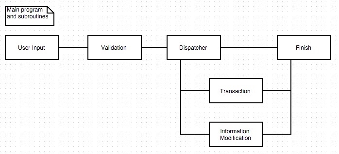
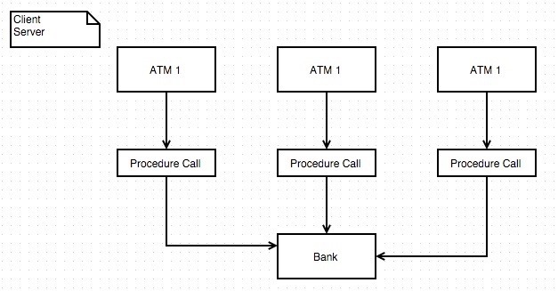

# 18653 HW3.2

## Main program and sub routines

This style is quite similar with the design of programming, using sequence, branch and loops to construct the logic of the whole system. Based on different transaction, combing the common steps, using a dispatcher to control the program to jump to sub routines then jump back:

+ Component: Sub routines
+ Connector: stream
+ Data Element: Binary information
+ Behavior: using bacis control flow to handle different operation.

## Object Oriented 

The OO design is just like what I've done in HW1, each object can perform several tasks without any assistance: 

+ Component: Objects
+ Connector: Messages and method invocations
+ Data Element: Varies from different classes
+ Behavior: Objects are responsible for their internal representation integrity

## Virtual machines

This is a typical style of layering. Different layers communicate with each other by different API: 

+ Component: components from different layer
+ Connector: Protocols of layer interaction
+ Data Element: Based on the definition of protocols
+ Behavior: Based on the definition of protocols

## Client Server

This is also a layered model with the seperation of client and server. Client needs to perform some basic validation and computation, the server use its powerful hardware system to make sure everything works well. This is one of the natural architecture for ATM machines.

+ Component: clients and servers
+ Connector: RPC-based network interaction protocols
+ Data Element: Based on the definition of protocols
+ Behavior: Based on the definition of protocols

## Batch Sequence

This style is similar as the first style. The only difference is that it is based on the dataflow, not the control flow:

+ Component: separate programs
+ Connector: stream or human hand
+ Data Element: explicit, aggretate elements
+ Behavior: from head to toe

## Pipe and filter

This style is not proper for the interaction of ATM as each operation needs the confirmation from the user. This style requires the user to input all the content in the first place:

+ Component: filters
+ Connector: pipes
+ Data Element: streaming data
+ Behavior: high flexibility

## Blackboard

This style is similar to the client-server style, with a unified data access api to control the flow and data. One possible design is:

+ Component: blackboard and components operating on the blackboard
+ Connector: control flow from the blackboard
+ Data Element: defined by blackboard
+ Behavior: defined by blackboard

## C2

The main idea is using events to connect different components:

+ Component: Independent, potentially concurent message generators and/or consumers
+ Connector: message routers, notifications and requests
+ Data Element: Messages
+ Behavior: top-bottom structure

